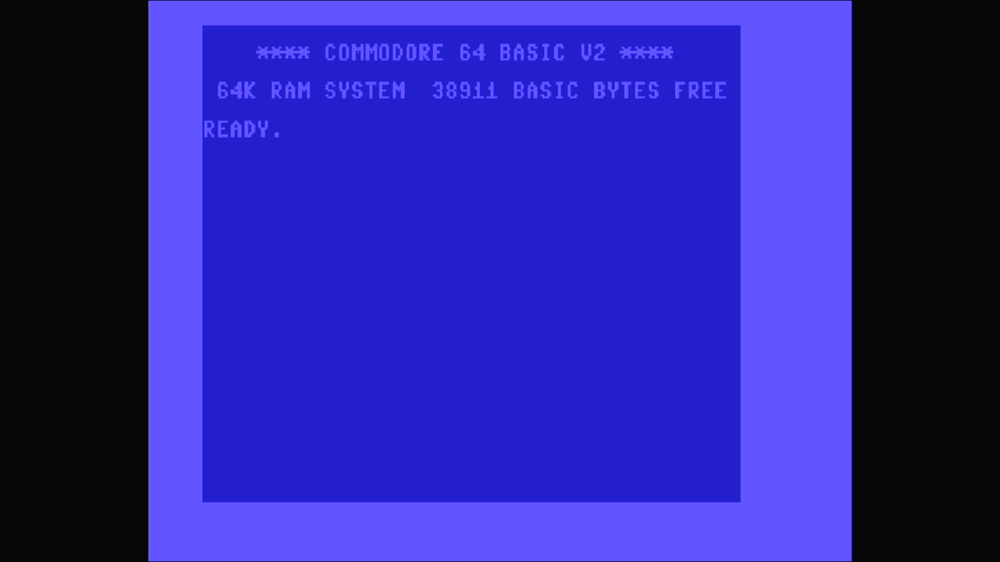

# Educator 64

- **`make MACHINE=edu64`** — Commodore Business Machines
- **Year**: 1983
- **Manufacturer**: Commodore Business Machines
- **Television**: NTSC

## At power-on

The Educator 64 is a Commodore 64 rehoused in a PET-style all-in-one case
with a built-in monochrome monitor, aimed at the education market. It shares
the PET 64's machine configuration, but — unlike the PET 64 — it carries the
**standard C64 KERNAL** (revision 3), so it boots straight to the familiar
C64 BASIC sign-on: **`**** COMMODORE 64 BASIC V2 ****`**, `64K RAM SYSTEM
38911 BASIC BYTES FREE`, and the `READY.` prompt.

Because it runs the standard KERNAL, the Educator 64 powers on with the
classic C64 **light-blue text on a dark-blue screen** — the KERNAL sets those
screen colours at boot. MAME still flags this driver `MACHINE_WRONG_COLORS`:
the driver shares the PET 64's config, whose green-monochrome palette is a
TODO (the real unit drove a monochrome monitor, so the emulated colours do
not match the hardware). The flag is a note, not a blocker — the machine
boots straight through to BASIC with no blocking warnings box, exactly as it
does on the bench.

The Educator 64's romset is a `#define` alias of the base C64
(`rom_edu64 rom_c64`): byte-for-byte the same four ROMs the standard
Commodore 64 loads.

## Required assets

- `roms/edu64.zip`

  | ROM | CRC32 |
  |---|---|
  | `901226-01.u3` (basic) | `f833d117` |
  | `901227-03.u4` (kernal r3) | `dbe3e7c7` |
  | `901225-01.u5` (chargen) | `ec4272ee` |
  | `906114-01.u17` (PLA) | `54c89351` |

  A `#define` alias romset (`rom_edu64 rom_c64`) — byte-identical to the base
  C64. The four required members are located by checksum in the parent
  `c64.zip` under the exact filenames this driver expects and repacked into
  `edu64.zip`. The PLA dump is flagged `BAD_DUMP` upstream (MAME warns
  `ROM NEEDS REDUMP` on the serial console); it loads and boots normally.

[← back to Commodore](README.md)
