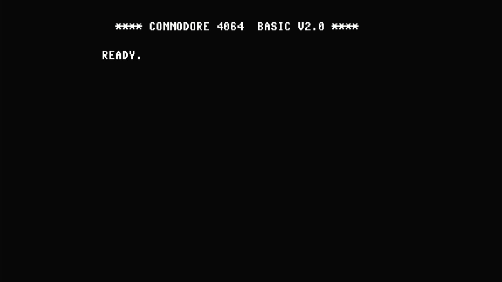

# PET 64 / CBM 4064

- **`make kernel MACHINE=pet64`** — Commodore Business Machines
- **Year**: 1983
- **Manufacturer**: Commodore Business Machines
- **Television**: NTSC

## At power-on

The PET 64 (sold as the CBM 4064 / Educator 64) is a Commodore 64 rehoused
in a PET-style all-in-one case with a built-in **green monochrome monitor**,
aimed at the education market. It runs standard C64 hardware, so it boots
straight to the familiar BASIC sign-on and `READY.` prompt — here reading
**`**** COMMODORE 4064  BASIC V2.0 ****`**, the banner produced by its own
early KERNAL (revision 1).

**The display is monochrome, not colour.** MAME flags this driver
`MACHINE_WRONG_COLORS`: the emulated PET 64 renders as plain **white text on
a black background** rather than the C64's usual light-blue-on-dark-blue,
because the driver's palette for this machine is still a TODO (the real unit
drove a green-screen monitor, and MAME has not yet mapped the green
monochrome tube). White-on-black is exactly what the glass shows — a
faithful *monochrome* PET 64, without the green tint of the original CRT.
The machine boots straight through to BASIC with no blocking warnings box.

The PET 64 carries its own unique KERNAL (`901246-01.u4`, C64 KERNAL rev. 1)
and shares its BASIC, character generator and PLA with the rest of the C64
line by checksum.

## Required assets

- `roms/pet64.zip`

  | ROM | CRC32 |
  |---|---|
  | `901246-01.u4` (kernal r1) | `789c8cc5` |
  | `901226-01.u3` (basic) | `f833d117` |
  | `901225-01.u5` (chargen) | `ec4272ee` |
  | `906114-01.u17` (PLA) | `54c89351` |

  A distinct romset — not a `#define` alias. The KERNAL (`901246-01.u4`) is
  the earliest C64 KERNAL revision, unique to the PET 64, and comes from its
  own split-set zip. The BASIC (`901226-01.u3`), character generator
  (`901225-01.u5`) and PLA content (`906114-01.u17`) are the standard C64
  parts, located by checksum in the parent `c64.zip` under the exact
  filenames this driver expects. The PLA dump is flagged `BAD_DUMP` upstream
  (MAME warns `ROM NEEDS REDUMP` on the serial console); it loads and boots
  normally.

[← back to Commodore](README.md)
