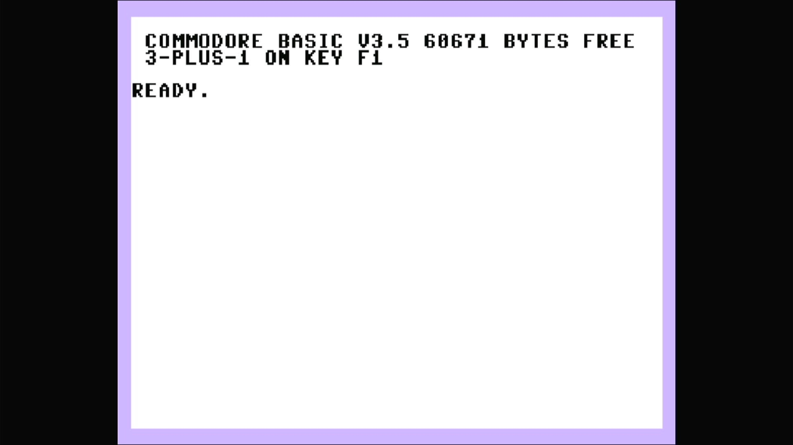

# Plus/4 (PAL)

- **`make MACHINE=plus4p`** — Commodore Business Machines
- **Year**: 1984
- **Manufacturer**: Commodore Business Machines
- **Television**: PAL

## At power-on

This is the PAL Plus/4 — the European sibling of the NTSC
[`plus4`](plus4.md). Same "264 series" hardware built around the MOS **TED**
(7360/8360) chip that handles video, sound and I/O in a single part, same
7501/8501 CPU and 64 KB of RAM, same built-in **3-PLUS-1** productivity suite
(word processor, spreadsheet, database and graphing) in ROM. The difference is
the kernal and the video timing: the PAL machine ships the `318004-05` kernal
(part 318004, versus the NTSC `plus4`'s 318005) and renders on the PAL canvas.

It boots straight to the character generator's sign-on and `READY.` prompt,
here reading **`COMMODORE BASIC V3.5`** with **`60671 BYTES FREE`** and the
line **`3-PLUS-1 ON KEY F1`** — the built-in suite, launchable from the
function key. Note the BASIC version: the Plus/4 runs **BASIC 3.5**, a
substantially richer dialect than the C64/VIC-20's BASIC 2.0, with graphics,
sound and disk commands built in — and its 60671 free bytes dwarf the C64's
38911, because BASIC 3.5 can address far more of the 64 KB.

The glass shows the Plus/4's own **TED pastel palette** — a pale lavender
border around a white screen with black text — visually unlike anything else
on this appliance's Commodore platform (the C64's blue-on-blue, the VIC-20's
cyan-and-white). This is the `plus4p` clone of the same
`src/mame/commodore/plus4.cpp`, `plus4_state` driver that carries the NTSC
`plus4`, part of the TED/264 family — none of it comes from `c64.cpp` or
`vic20.cpp`.

MAME flags this driver `MACHINE_SUPPORTS_SAVE` only (no imperfect-graphics or
imperfect-sound warning), and it boots straight through to BASIC with no
warnings box.

## Required assets

- `roms/plus4p.zip`

  | ROM | CRC32 |
  |---|---|
  | `318004-05.u24` (kernal, PAL rev.5) | `71c07bd4` |
  | `318006-01.u23` (basic) | `74eaae87` |
  | `317053-01.u25` (3-PLUS-1 lo) | `4fd1d8cb` |
  | `317054-01.u26` (3-PLUS-1 hi) | `109de2fc` |
  | `251641-02.u19` (PLA) | `83be2076` |

  `plus4p` is a clone of the parent `c264` (the Commodore 264 prototype) under
  MAME's split-set convention, so its members span two source zips: the unique
  **PAL** revision-5 kernal (`318004-05.u24`, the `ROM_DEFAULT_BIOS("r5")`
  selection — note part `318004` versus the NTSC `plus4`'s `318005`), the BASIC
  ROM (`318006-01.u23`) and the two **3-PLUS-1** function ROMs
  (`317053-01.u25`, `317054-01.u26`) come from `plus4p.zip`, while the PLA
  (`251641-02.u19`) is byte-identical to the parent's (CRC `83be2076`) and is
  packed only in `c264.zip`. All five are located by checksum and repacked
  under the exact filenames this driver expects. The r3, r4 and Diag264
  alternate kernals (optional `ROM_SYSTEM_BIOS` alternates) are not required to
  boot and are not packed.

## Quirks

- **The 3-PLUS-1 suite is ROM, not media.** The word-processor / spreadsheet /
  database / graphing suite lives in the machine's own "function" ROM region
  (`317053-01` + `317054-01`) — it is baked firmware, part of the romset, not a
  cartridge or disk this appliance mounts. That is why the sign-on offers it on
  power-on.
- **The IEC disk bus boots empty.** Despite its different TED-based hardware,
  the Plus/4 wires the same Commodore serial bus as the C64 and VIC-20 lines —
  a C1541 drive defaulting to device 8, whose own ROM would be a second romset
  this appliance doesn't need to reach BASIC. The kernel bakes `-iec8 ""`,
  exactly as the rest of the Commodore line does; a real Plus/4 with nothing
  plugged into its serial port is a completely valid, common configuration.

[← back to Commodore](README.md)
