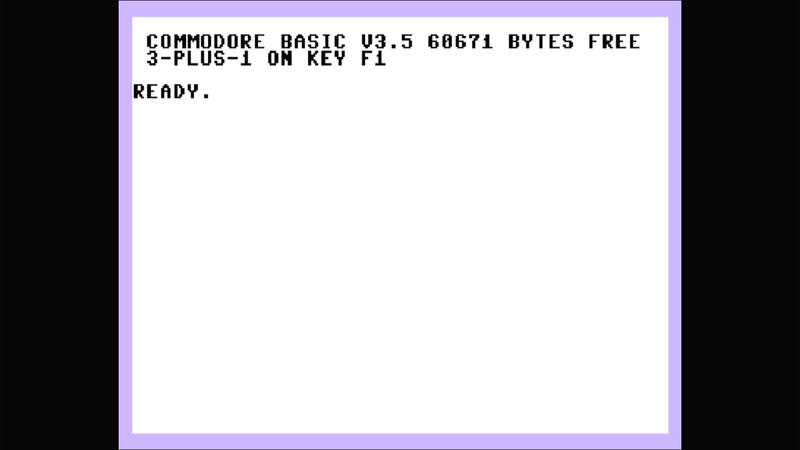

# Plus/4 (PAL)

- **`make kernel MACHINE=plus4p`** — Commodore
- **Year**: 1984
- **Manufacturer**: Commodore Business Machines
- **Television**: PAL

## At power-on

This is the PAL Plus/4 — the European sibling of the NTSC [`plus4`](plus4.md). Same "264 series" hardware built around the MOS **TED** (7360/8360) chip that handles video, sound and I/O in a single part, same 7501/8501 CPU and 64 KB of RAM, same built-in **3-PLUS-1** productivity suite (word processor, spreadsheet, database and graphing) in ROM. The difference is the kernal and the video timing: the PAL machine ships the `318004-05` kernal (part 318004, versus the NTSC `plus4`'s 318005) and renders on the PAL canvas. It boots straight to the character generator's sign-on and `READY.` prompt, here reading **`COMMODORE BASIC V3.5`** with **`60671 BYTES FREE`** and the line **`3-PLUS-1 ON KEY F1`** — the built-in suite, launchable from the function key. Note the BASIC version: the Plus/4 runs **BASIC 3.5**, a substantially richer dialect than the C64/VIC-20's BASIC 2.0, with graphics, sound and disk commands built in — and its 60671 free bytes dwarf the C64's 38911, because BASIC 3.5 can address far more of the 64 KB. The glass shows the Plus/4's own **TED pastel palette** — a pale lavender border around a white screen with black text — visually unlike anything else on this appliance's Commodore platform (the C64's blue-on-blue, the VIC-20's cyan-and-white). This is the `plus4p` clone of the same `src/mame/commodore/plus4.cpp`, `plus4_state` driver that carries the NTSC `plus4`, part of the TED/264 family — none of it comes from `c64.cpp` or `vic20.cpp`. MAME flags this driver `MACHINE_SUPPORTS_SAVE` only (no imperfect-graphics or imperfect-sound warning), and it boots straight through to BASIC with no warnings box.

## Required assets

- `roms/plus4p.zip`

  | ROM | CRC32 |
  |---|---|
  | `318006-01.u23` | `74eaae87` |
  | `318004-03.u24` | `77bab934` |
  | `318004-04.u24` | `be54ed79` |
  | `318004-05.u24` | `71c07bd4` |
  | `diag264_097_pal_kernal.u24` | `bf0b3657` |
  | `317053-01.u25` | `4fd1d8cb` |
  | `317054-01.u26` | `109de2fc` |
  | `251641-02.u19` | `83be2076` |

## Notes

- MAME driver: `plus4.cpp`.
- MAME clone of `c264` (Commodore 264 (Prototype)) — the system macro's parent field in the driver source. The ROM table above lists every member this machine's own zip needs.
- **The 3-PLUS-1 suite is ROM, not media.** The word-processor / spreadsheet / database / graphing suite lives in the machine's own "function" ROM region (`317053-01` + `317054-01`) — it is baked firmware, part of the romset, not a cartridge or disk this appliance mounts. That is why the sign-on offers it on power-on.

[← back to Commodore](README.md)
