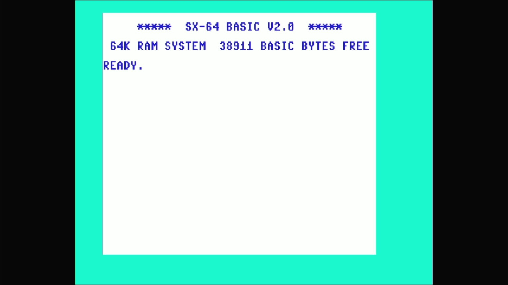

# SX-64 / Executive 64 (NTSC)



- **`make MACHINE=sx64`** — Commodore Business Machines
- **Year**: 1984
- **Manufacturer**: Commodore Business Machines
- **Television**: NTSC

## At power-on

The SX-64 is the portable, luggable C64 with a built-in 5.25" 1541 drive.
Its own KERNAL draws a **distinct sign-on**: `***** SX-64 BASIC V2.0
*****`, `64K RAM SYSTEM  38911 BASIC BYTES FREE`, `READY.` — the SX
kernal's inverted colour scheme, dark-blue text on a white screen (the
breadbin's light-blue-on-dark-blue is reversed), which is the appliance's
proof this is the SX romset and not a plain c64.

## The built-in drive

The SX-64's defining hardware is its internal 1541. In the driver, the
`ntsc_sx` machine config **replaces the iec8 slot's default** with the
built-in drive (`sx1541`) rather than the breadbin's empty/optional c1541:

```
CBM_IEC_SLOT(config.replace(), "iec8", 8, sx1541_iec_devices, "sx1541");
```

It is still the **iec8 slot**, emptied the same way as every other C64 in
this line — `-iec8 ""`. Device 8 is baked empty, so no 1541 drive romset is
required to reach BASIC. A real SX-64 always has its internal drive, so an
empty bus is a documented appliance quirk rather than a faithful hardware
configuration; it is the smallest honest parcel and boots straight to the
SX kernal's own sign-on. The same `sx64_state` / iec8-slot answer covers
the PAL and clone siblings (`sx64p`, `vip64`, `dx64`, `tesa6240`) — all
emptyable the same way, no drive romset needed to reach BASIC.

## Required assets

- `roms/sx64.zip`

  | ROM | CRC32 |
  |---|---|
  | `901226-01.ud4` (basic) | `f833d117` |
  | `251104-04.ud3` (kernal SX) | `2c5965d4` |
  | `901225-01.ud1` (chargen) | `ec4272ee` |
  | `906114-01.ue4` (PLA) | `54c89351` |

  A distinct romset — not a `#define` alias of `rom_c64`. The SX KERNAL
  (`251104-04.ud3`, default BIOS `cbm` "Original" — the first of four
  `ROM_SYSTEM_BIOS` choices) is unique to this machine and comes from its
  own split-set zip. The basic, character generator and PLA are
  byte-identical in content to `c64`'s members, located by CRC32 in the
  parent `c64.zip` and repacked under the `ud4`/`ud1`/`ue4` board-position
  names sx64 expects.

[← back to Commodore](README.md)
