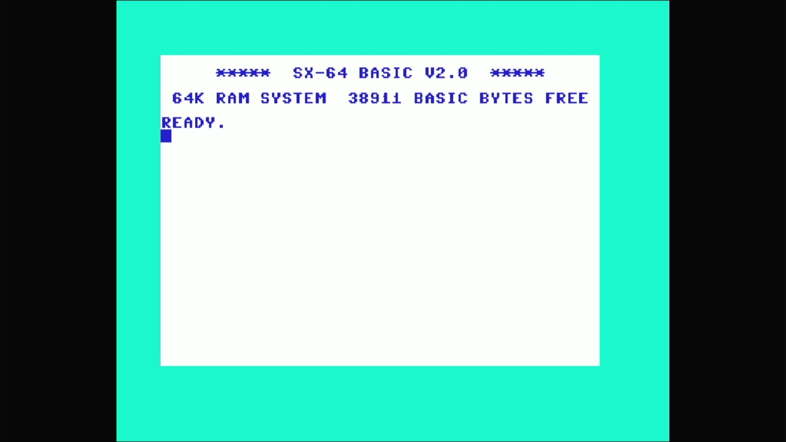

# SX-64 / Executive 64 (PAL)



- **`make kernel MACHINE=sx64p`** — Commodore
- **Year**: 1984
- **Manufacturer**: Commodore Business Machines
- **Television**: PAL

## At power-on

The SX-64 is the portable, luggable C64 with a built-in 5.25" 1541 drive. Its own KERNAL draws a **distinct sign-on**: `***** SX-64 BASIC V2.0 *****`, `64K RAM SYSTEM  38911 BASIC BYTES FREE`, `READY.` — the SX kernal's inverted colour scheme, dark-blue text on a white screen (the breadbin's light-blue-on-dark-blue is reversed), which is the appliance's proof this is the SX romset and not a plain c64. `sx64p` is the PAL SX-64 — the same machine as the NTSC `sx64`, differing only in video/CIA timing (PAL vs. NTSC), which is machine config, not ROM data: its sign-on and free-memory figure match, and it fills the taller PAL canvas.

## Required assets

- `roms/sx64p.zip`

  | ROM | CRC32 |
  |---|---|
  | `901226-01.ud4` (basic) | `f833d117` |
  | `251104-04.ud3` (kernal) | `2c5965d4` |
  | `jiffydos sx64.ud3` (kernal) | `2b5a88f5` |
  | `1541 flash.ud3` (kernal) | `0a1c9b85` |
  | `turboromsx.u4` (kernal) | `48579c30` |
  | `901225-01.ud1` (chargen) | `ec4272ee` |
  | `906114-01.ue4` | `54c89351` |
- `roms/sx1541.zip`

## Notes

- MAME driver: `c64.cpp`.
- MAME clone of `c64` (Commodore 64 (NTSC)) — the system macro's parent field in the driver source. The ROM table above lists every member this machine's own zip needs.

## The built-in drive

The SX-64's defining hardware is its internal 1541. In the driver, the
`pal_sx` machine config **replaces the iec8 slot's default** with the
built-in drive (`sx1541`) rather than the breadbin's empty/optional c1541:

```
CBM_IEC_SLOT(config.replace(), "iec8", 8, sx1541_iec_devices, "sx1541");
```

This drive is **built-in hardware**, and built-in hardware is never removed:
the appliance ships the machine as the driver defines it, with no `-iec8`
override. MAME's `sx1541` default at device 8 stands, so the machine requires
the `sx1541` drive romset and boots to the SX kernal's own sign-on **with its
internal drive present**. (The C64-line `-iec8 ""` bake applies only to
machines whose device-8 default models an *external*, plug-in drive — never
to a built-in one.) The same built-in `sx1541` is fitted on the NTSC `sx64`
and the other clone siblings (`vip64`, `tesa6240`, and *twice* on `dx64`).

[← back to Commodore](README.md)
