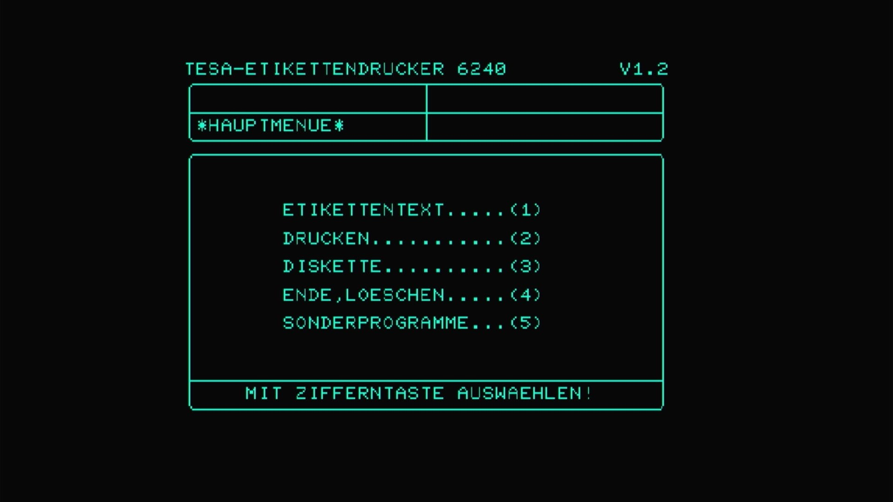

# Tesa Etikett Etikettendrucker 6240 (PAL)



- **`make MACHINE=tesa6240`** — Tesa Etikett
- **Year**: 1984
- **Manufacturer**: Tesa Etikett
- **Television**: PAL

## At power-on

The Tesa 6240 is an **industrial label printer** (*Etikettendrucker*) built
on SX-64 (Executive 64) hardware, but it does **not** boot to a BASIC
prompt. Its bespoke KERNAL takes over the machine at power-on and draws the
printer's own German-language application — a boxed **main menu**
(`*HAUPTMENUE*`) in green on black:

```
TESA-ETIKETTENDRUCKER 6240          V1.2

*HAUPTMENUE*

        ETIKETTENTEXT.....(1)
        DRUCKEN...........(2)
        DISKETTE..........(3)
        ENDE,LOESCHEN.....(4)
        SONDERPROGRAMME...(5)

        MIT ZIFFERNTASTE AUSWAEHLEN!
```

The options are the printer's operator functions — *label text* (1),
*print* (2), *diskette* (3), *end / clear* (4), *special programs* (5) —
selected `MIT ZIFFERNTASTE` ("with a number key"). Version **V1.2** is
stamped top-right. This is the machine's own face: a self-contained
label-printer front end, not the C64/SX BASIC every other machine in this
line signs on with. All three of its main ROMs (BASIC, KERNAL and
character generator) are unique to the Tesa firmware.

## The built-in drive

Like every machine in the `sx64_state` family, the Tesa 6240 runs the
`pal_sx` machine config, which **replaces the iec8 slot's default** with the
SX-64's built-in drive (`sx1541`):

```
CBM_IEC_SLOT(config.replace(), "iec8", 8, sx1541_iec_devices, "sx1541");
```

This drive is **built-in hardware**, and built-in hardware is never removed:
the appliance ships the machine as the driver defines it, with no `-iec8`
override. MAME's `sx1541` default at device 8 stands, so the machine requires
the `sx1541` drive romset and boots to the Tesa firmware's own main menu
**with its internal drive present** — the drive backing the on-screen
`DISKETTE` operator function. (The C64-line `-iec8 ""` bake applies only to
machines whose device-8 default models an *external*, plug-in drive — never
to a built-in one.)

## Required assets

- `roms/tesa6240.zip`

  | ROM | CRC32 |
  |---|---|
  | `tesa-basic.ud4` (basic) | `f319d661` |
  | `tesa-kernal.ud3` (kernal) | `af638f9c` |
  | `tesa-char.ud1` (chargen) | `10765a90` |
  | `906114-01.ue4` (PLA) | `54c89351` |

  A distinct romset — not a `#define` alias of `rom_sx64`. Unlike the
  `vip64` sibling (which shares the c64 BASIC), **all three** of the Tesa's
  main ROMs — the bespoke BASIC (`tesa-basic.ud4`), KERNAL
  (`tesa-kernal.ud3`) and character generator (`tesa-char.ud1`) — are unique
  to the label-printer firmware and come from its own split-set zip. Only
  the PLA (`906114-01.ue4`) is byte-identical to `c64`'s member, located by
  CRC32 in the parent `c64.zip` and repacked under the `ue4` board-position
  name tesa6240 expects.

- `roms/sx1541.zip` — the built-in drive's device romset (looked up by the
  device shortname `sx1541`).

  | ROM | CRC32 |
  |---|---|
  | `325302-01.uab4` (always loaded) | `29ae9752` |
  | `901229-05 ae.uab5` (r5, default BIOS) | `361c9f37` |
  | `jiffydos sx1541` (BIOS 1) | `783575f6` |
  | `1541 flash.uab5` (BIOS 2) | `22f7757e` |

  The Tesa 6240's internal SX1541 is built-in hardware and ships its romset.
  Its `ROM_START( sx1541 )` (in `src/devices/bus/cbmiec/c1541.cpp`) defaults
  to BIOS `r5`; the self-contained split-set zip is staged verbatim (all four
  members). Member filenames contain spaces and must be preserved exactly.

[← back to Commodore](README.md)
