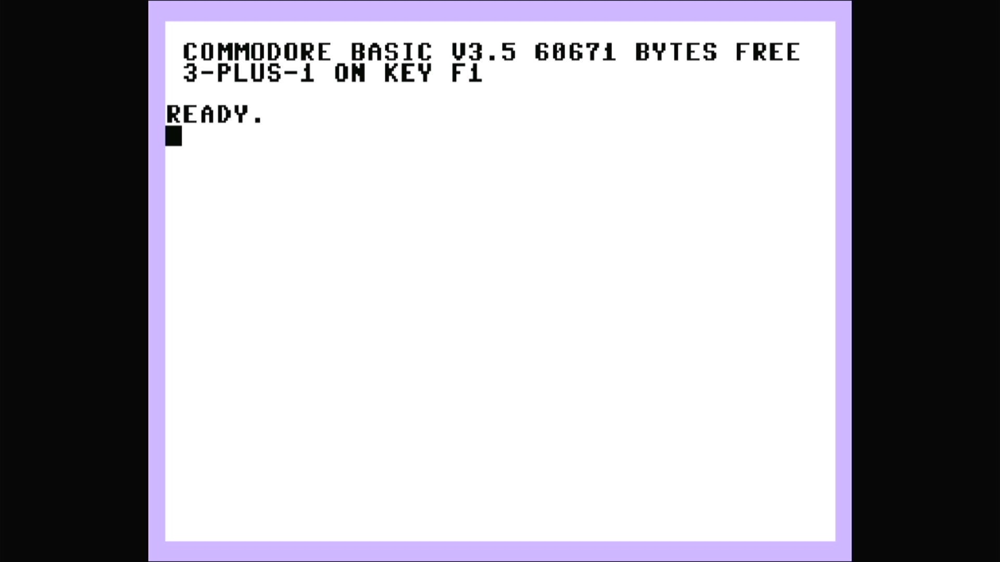

# Commodore V364 (NTSC, prototype)

- **`make kernel MACHINE=v364`** — Commodore Business Machines
- **Year**: 1984
- **Manufacturer**: Commodore Business Machines
- **Television**: NTSC

## At power-on

The Commodore V364 was a **pre-production prototype** in Commodore's 1984 "264
series" — the same TED-based family as the Plus/4 and the C16, built around the
MOS **TED** (7360/8360) chip that handles video, sound and I/O in one part. It
was the flagship of the range that never shipped: a full **64 KB** machine with
the Plus/4's built-in **3-PLUS-1** productivity suite **plus a numeric keypad
and, uniquely, a T6721A speech synthesiser** — the V364 was designed to *talk*,
announcing itself at power-on and speaking a built-in word set. In MAME it lives
in `src/mame/commodore/plus4.cpp` as a clone of the `c264` prototype parent
(`c16_state`, machine config `v364` — the NTSC Plus/4 config `plus4n` with the
**T6721A** speech synthesiser and **MOS8706** speech/voice LSI added).

This is the **NTSC** machine — the `v364` config calls `plus4n`, so it inherits
the NTSC dot clock and fills the **720x480 NTSC canvas**. It boots straight to
the sign-on and `READY.` prompt, here reading **`COMMODORE BASIC V3.5`** with
**`60671 BYTES FREE`** followed by the **`3-PLUS-1 ON KEY F1`** line. That
combination is the machine's identity: the full 64 KB (the same `60671` as the
Plus/4, far above the C16's `12277` or the 232's `28661`) *and* the 3-PLUS-1
prompt, which only the machines carrying the function ROMs advertise. It runs
the same **BASIC 3.5** as the rest of the 264 line (a substantially richer
dialect than the C64/VIC-20's BASIC 2.0, with graphics, sound and disk commands
built in).

The glass shows the same **TED pastel palette** as the rest of the 264 line — a
pale lavender border around a white screen with black text — visually unlike
anything else on this appliance's Commodore platform (the C64's blue-on-blue,
the VIC-20's cyan-and-white). This is the TED/264 driver
(`src/mame/commodore/plus4.cpp`), the same family as the Plus/4 but a distinct
machine (`c16_state`, machine config `v364`) — none of it comes from `c64.cpp`
or `vic20.cpp`.

MAME flags this driver `MACHINE_SUPPORTS_SAVE` only (no imperfect-graphics or
imperfect-sound warning), and it boots straight through to BASIC with no
warnings box.

## Required assets

- `roms/v364.zip`

  | ROM | CRC32 |
  |---|---|
  | `318006-01` (basic) | `74eaae87` |
  | `kern364p` (kernal) | `84fd4f7a` |
  | `317053-01` (3-PLUS-1) | `4fd1d8cb` |
  | `317054-01` (3-PLUS-1) | `109de2fc` |
  | `spk3cc4.bin` (speech) | `5227c2ee` |
  | `251641-02` (PLA) | `83be2076` |

  v364 is a clone of the parent `c264` (the Commodore 264 prototype) under MAME's
  split-set convention. Two ROMs are **unique to the V364** — the kernal
  `kern364p` (`84fd4f7a`) and the **speech ROM `spk3cc4.bin` (`5227c2ee`)** that
  feeds the T6721A synthesiser — and, with the shared basic (`318006-01`,
  byte-identical to the rest of the 264 line) and the full Plus/4 3-PLUS-1
  function pair (`317053-01` / `317054-01`), are packed under the exact
  `ROM_START( v364 )` names (no `.uXX` suffix) in the split-set clone zip
  `v364.zip`. The PLA (`251641-02`) is byte-identical to the parent's (CRC
  `83be2076`) and merges from `c264.zip`. All are located by checksum and
  repacked under the filenames this driver expects.

## Quirks

- **The speaking prototype.** The V364's defining hardware is its **T6721A
  speech synthesiser**, driven by the baked speech ROM `spk3cc4.bin` and a
  MOS8706 voice LSI. No other machine on this appliance carries it. The speech is
  audio hardware — it does not print to the screen — so the sign-on shown here is
  the standard Plus/4 3-PLUS-1 face; the voice is what set the real V364 apart.
- **Full 64 KB with the 3-PLUS-1 suite.** The `60671 BYTES FREE` and the
  `3-PLUS-1 ON KEY F1` line together mark this as the top of the 264 range —
  unlike the cut-down C16/232/116, the V364 carries the Plus/4's built-in
  productivity ROMs (`317053-01`, `317054-01`).
- **A prototype, not a product.** The V364 never shipped; it survives only as a
  MAME driver clone of the `c264` prototype parent. The unique `kern364p` kernal
  and `spk3cc4.bin` speech ROM are the artefacts that distinguish it from its
  siblings.
- **The IEC disk bus boots empty.** The `v364` machine config keeps the same
  Commodore serial bus as the C64, VIC-20 and Plus/4 lines — a C1541 drive
  defaulting to device 8, whose own ROM would be a second romset this appliance
  doesn't need to reach BASIC. The kernel bakes `-iec8 ""`, exactly as the rest
  of the Commodore line does; a real V364 with nothing plugged into its serial
  port is a completely valid, common configuration.

[← back to Commodore](README.md)
