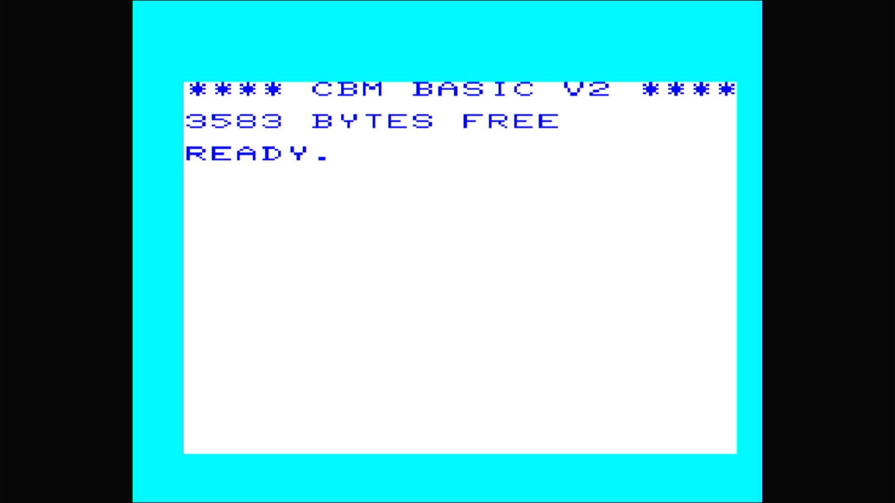

# VIC-1001 (Japan)

- **`make kernel MACHINE=vic1001`** — Commodore Business Machines
- **Year**: 1980
- **Manufacturer**: Commodore Business Machines
- **Television**: NTSC

## At power-on

The VIC-1001 is the **family parent** of the VIC-20 line — the machine
Commodore sold in Japan in 1980, a year before the same hardware reached the
US as the [`vic20`](vic20.md) and Europe as the VC-20
([`vic20p`](vic20p.md)). Same 6502 and 6560 "VIC" video chip, the first
colour home computer that went on to be the first computer of any kind to sell
a million units. It boots straight to the sign-on and `READY.` prompt, here
reading **`**** CBM BASIC V2 ****`** with **`3583 BYTES FREE`**: the
unexpanded machine ships with only ~3.5 KB of BASIC RAM (versus the C64's
38911), a defining constraint of the line.

The glass shows the VIC's own palette — a **cyan border**, a **white
screen**, and **dark-blue text** — distinct from the C64's blue-on-blue. This
is the parent of the `src/mame/commodore/vic20.cpp` `vic20_state` driver; the
NTSC `vic20` and PAL `vic20p` are its clones. The Japanese machine's
distinguishing hardware is its ROMs — a **Japanese kernal** (`901486-02`) and
a **katakana character generator** (`901460-02`) — but the katakana glyphs sit
in the upper half of the character set, so the ASCII sign-on text reads
identically to its Western siblings.

MAME flags this driver `MACHINE_IMPERFECT_GRAPHICS | MACHINE_IMPERFECT_SOUND`,
but — like the rest of this line on this appliance — it boots straight through
to BASIC with no blocking warnings box.

## Required assets

- `roms/vic1001.zip`

  | ROM | CRC32 |
  |---|---|
  | `901486-01` (basic) | `db4c43c1` |
  | `901486-02` (kernal) | `336900d7` |
  | `901460-02` (chargen) | `fcfd8a4b` |

  `vic1001` is the **parent** of the VIC-20 line, so under MAME's split-set
  convention its zip carries the full romset — every member lives in
  `vic1001.zip` and no sibling zip is needed. The BASIC ROM (`901486-01`) is
  byte-identical (CRC `db4c43c1`) to the one the clones share; the kernal
  (`901486-02`) and character generator (`901460-02`) are the Japan-unique
  members. There are no `ROM_SYSTEM_BIOS` alternates — the parent has a single
  kernal. The driver names the members plainly, without the `.ue11`/`.ud7`
  suffixes its clones use.

## Quirks

- **The IEC disk bus boots empty.** The VIC-1001 wires the same Commodore
  serial bus as the C64 line — a C1541 drive defaulting to device 8, whose own
  ROM would be a second romset this appliance doesn't need to reach BASIC. The
  kernel bakes `-iec8 ""`, exactly as the C64 machines do; a real VIC with
  nothing plugged into its serial port is a completely valid, common
  configuration.

[← back to Commodore](README.md)
