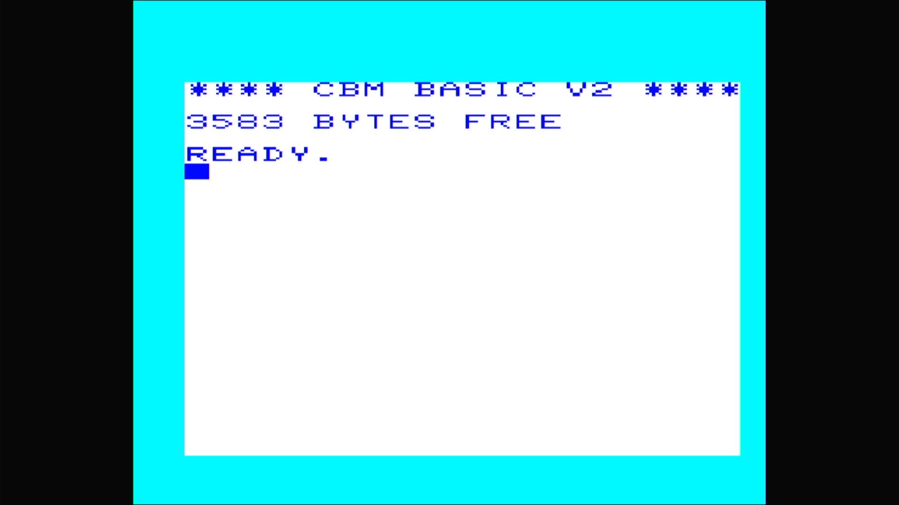

# VIC-20

- **`make MACHINE=vic20`** — Commodore Business Machines
- **Year**: 1981
- **Manufacturer**: Commodore Business Machines
- **Television**: NTSC

## At power-on

The VIC-20 (marketed in Japan as the VIC-1001, in Europe as the VC-20) was
Commodore's first colour home computer and the first computer of any kind to
sell a million units. It predates the C64 by a year and runs a 6502 with the
6560 "VIC" video chip. This is the NTSC machine — it boots straight to the
character generator's sign-on and `READY.` prompt, here reading
**`**** CBM BASIC V2 ****`** with **`3583 BYTES FREE`**: the unexpanded
VIC-20 ships with only ~3.5 KB of BASIC RAM (versus the C64's 38911), a
defining constraint of the machine.

The glass shows the VIC-20's own palette — a **cyan border**, a **white
screen**, and **dark-blue text** — distinct from the C64's blue-on-blue.
This is a different driver (`src/mame/commodore/vic20.cpp`,
`vic20_state`), the first machine on this appliance's Commodore platform that
does not come from `c64.cpp`.

MAME flags this driver `MACHINE_IMPERFECT_GRAPHICS | MACHINE_IMPERFECT_SOUND`,
but — like the rest of this line on this appliance — it boots straight through
to BASIC with no blocking warnings box.

## Required assets

- `roms/vic20.zip`

  | ROM | CRC32 |
  |---|---|
  | `901486-01.ue11` (basic) | `db4c43c1` |
  | `901486-06.ue12` (kernal) | `e5e7c174` |
  | `901460-03.ud7` (chargen) | `83e032a6` |

  vic20 is a clone of the parent `vic1001` under MAME's split-set
  convention, so its members span two source zips: the unique kernal
  (`901486-06.ue12`, the default "cbm" BIOS) and character generator
  (`901460-03.ud7`) come from `vic20.zip`, while the BASIC ROM
  (`901486-01.ue11`) is byte-identical to the parent's (CRC `db4c43c1`) and is
  packed only in `vic1001.zip`. All three are located by checksum and repacked
  under the exact filenames this driver expects. The JiffyDOS alternate kernal
  (an optional `ROM_SYSTEM_BIOS` alternate) is not required to boot and is not
  packed.

## Quirks

- **The IEC disk bus boots empty.** The VIC-20 wires the same Commodore serial
  bus as the C64 line — a C1541 drive defaulting to device 8, whose own ROM
  would be a second romset this appliance doesn't need to reach BASIC. The
  kernel bakes `-iec8 ""`, exactly as the C64 machines do; a real VIC-20 with
  nothing plugged into its serial port is a completely valid, common
  configuration.

[← back to Commodore](README.md)
