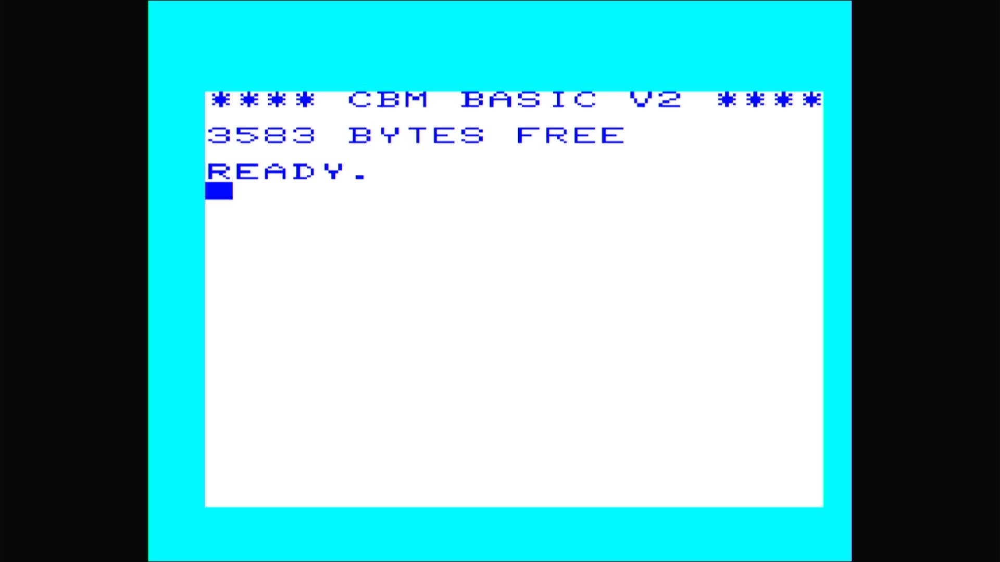

# VIC-20 (NTSC)

- **`make kernel MACHINE=vic20`** — Commodore
- **Year**: 1981
- **Manufacturer**: Commodore Business Machines
- **Television**: NTSC

## At power-on

The VIC-20 (marketed in Japan as the VIC-1001, in Europe as the VC-20) was Commodore's first colour home computer and the first computer of any kind to sell a million units. It predates the C64 by a year and runs a 6502 with the 6560 "VIC" video chip. This is the NTSC machine — it boots straight to the character generator's sign-on and `READY.` prompt, here reading **`**** CBM BASIC V2 ****`** with **`3583 BYTES FREE`**: the unexpanded VIC-20 ships with only ~3.5 KB of BASIC RAM (versus the C64's 38911), a defining constraint of the machine. The glass shows the VIC-20's own palette — a **cyan border**, a **white screen**, and **dark-blue text** — distinct from the C64's blue-on-blue. This is a different driver (`src/mame/commodore/vic20.cpp`, `vic20_state`), the first machine on this appliance's Commodore platform that does not come from `c64.cpp`. MAME flags this driver `MACHINE_IMPERFECT_GRAPHICS | MACHINE_IMPERFECT_SOUND`, but — like the rest of this line on this appliance — it boots straight through to BASIC with no blocking warnings box.

## Required assets

- `roms/vic20.zip`

  | ROM | CRC32 |
  |---|---|
  | `901486-01.ue11` | `db4c43c1` |
  | `901486-06.ue12` | `e5e7c174` |
  | `jiffydos vic-20 ntsc.ue12` | `683a757f` |
  | `901460-03.ud7` | `83e032a6` |

## Notes

- MAME driver: `vic20.cpp`.
- MAME clone of `vic1001` (VIC-1001 (Japan)) — the system macro's parent field in the driver source. The ROM table above lists every member this machine's own zip needs.

[← back to Commodore](README.md)
