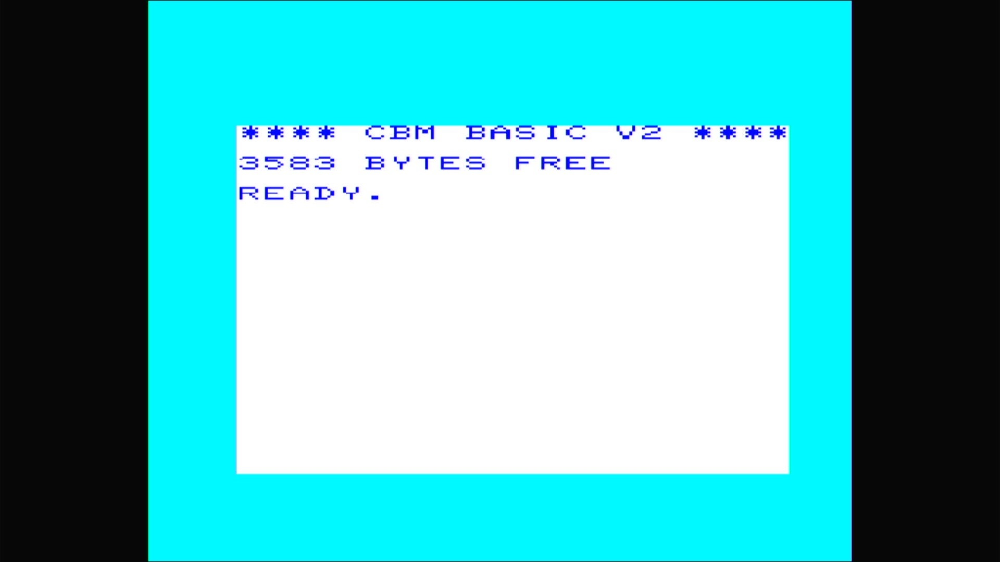

# VIC-20 (PAL)

- **`make kernel MACHINE=vic20p`** — Commodore Business Machines
- **Year**: 1981
- **Manufacturer**: Commodore Business Machines
- **Television**: PAL

## At power-on

This is the PAL VIC-20 — the machine Commodore sold across Europe as the
**VC-20** (the NTSC sibling, marketed in Japan as the VIC-1001, is
[`vic20`](vic20.md)). Same 6502 and 6560/6561 "VIC" video chip, same first
colour home computer that became the first computer of any kind to sell a
million units; the difference is the timing and the kernal. It boots straight
to the sign-on and `READY.` prompt, here reading
**`**** CBM BASIC V2 ****`** with **`3583 BYTES FREE`**: the unexpanded
VIC-20 ships with only ~3.5 KB of BASIC RAM (versus the C64's 38911), a
defining constraint of the machine.

The glass shows the VIC-20's own palette — a **cyan border**, a **white
screen**, and **dark-blue text** — distinct from the C64's blue-on-blue. It
renders on the PAL canvas. This is the `vic20p` clone of the same
`src/mame/commodore/vic20.cpp` `vic20_state` driver that carries the NTSC
`vic20`.

MAME flags this driver `MACHINE_IMPERFECT_GRAPHICS | MACHINE_IMPERFECT_SOUND`,
but — like the rest of this line on this appliance — it boots straight through
to BASIC with no blocking warnings box.

## Required assets

- `roms/vic20p.zip`

  | ROM | CRC32 |
  |---|---|
  | `901486-01.ue11` (basic) | `db4c43c1` |
  | `901486-07.ue12` (kernal) | `4be07cb4` |
  | `901460-03.ud7` (chargen) | `83e032a6` |

  `vic20p` is a clone of the parent `vic1001` under MAME's split-set
  convention, so its members span source zips: the unique **PAL** kernal
  (`901486-07.ue12`, the default "cbm" BIOS — note `-07` versus the NTSC
  `vic20`'s `-06`) comes from `vic20p.zip`, the character generator
  (`901460-03.ud7`) is byte-identical to the NTSC `vic20`'s, and the BASIC ROM
  (`901486-01.ue11`) is byte-identical to the parent's (CRC `db4c43c1`) and is
  packed only in `vic1001.zip`. All three are located by checksum and repacked
  under the exact filenames this driver expects. The JiffyDOS PAL alternate
  kernal (an optional `ROM_SYSTEM_BIOS` alternate) is not required to boot and
  is not packed.

## Quirks

- **The IEC disk bus boots empty.** The VIC-20 wires the same Commodore serial
  bus as the C64 line — a C1541 drive defaulting to device 8, whose own ROM
  would be a second romset this appliance doesn't need to reach BASIC. The
  kernel bakes `-iec8 ""`, exactly as the C64 machines do; a real VIC-20 with
  nothing plugged into its serial port is a completely valid, common
  configuration.

[← back to Commodore](README.md)
