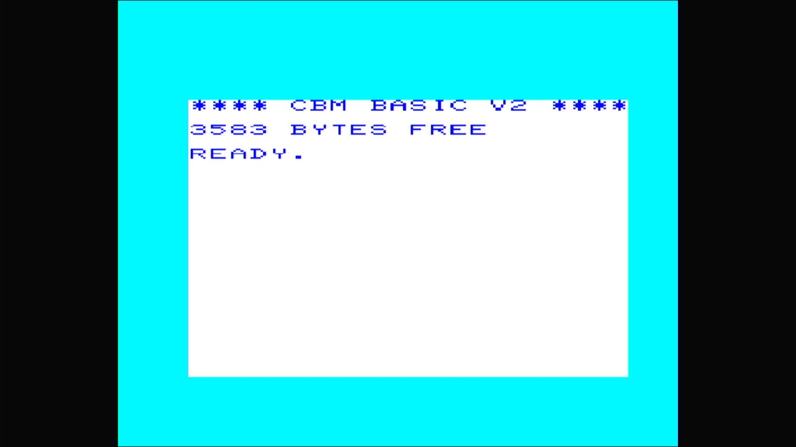

# VIC-20 / VC-20 (PAL)

- **`make kernel MACHINE=vic20p`** — Commodore
- **Year**: 1981
- **Manufacturer**: Commodore Business Machines
- **Television**: PAL

## At power-on

This is the PAL VIC-20 — the machine Commodore sold across Europe as the **VC-20** (the NTSC sibling, marketed in Japan as the VIC-1001, is [`vic20`](vic20.md)). Same 6502 and 6560/6561 "VIC" video chip, same first colour home computer that became the first computer of any kind to sell a million units; the difference is the timing and the kernal. It boots straight to the sign-on and `READY.` prompt, here reading **`**** CBM BASIC V2 ****`** with **`3583 BYTES FREE`**: the unexpanded VIC-20 ships with only ~3.5 KB of BASIC RAM (versus the C64's 38911), a defining constraint of the machine. The glass shows the VIC-20's own palette — a **cyan border**, a **white screen**, and **dark-blue text** — distinct from the C64's blue-on-blue. It renders on the PAL canvas. This is the `vic20p` clone of the same `src/mame/commodore/vic20.cpp` `vic20_state` driver that carries the NTSC `vic20`. MAME flags this driver `MACHINE_IMPERFECT_GRAPHICS | MACHINE_IMPERFECT_SOUND`, but — like the rest of this line on this appliance — it boots straight through to BASIC with no blocking warnings box.

## Required assets

- `roms/vic20p.zip`

  | ROM | CRC32 |
  |---|---|
  | `901486-01.ue11` (basic) | `db4c43c1` |
  | `901486-07.ue12` (kernal) | `4be07cb4` |
  | `jiffydos vic-20 pal.ue12` (kernal) | `705e7810` |
  | `901460-03.ud7` (chargen) | `83e032a6` |

## Notes

- MAME driver: `vic20.cpp`.
- MAME clone of `vic1001` (VIC-1001 (Japan)) — the system macro's parent field in the driver source. The ROM table above lists every member this machine's own zip needs.

[← back to Commodore](README.md)
