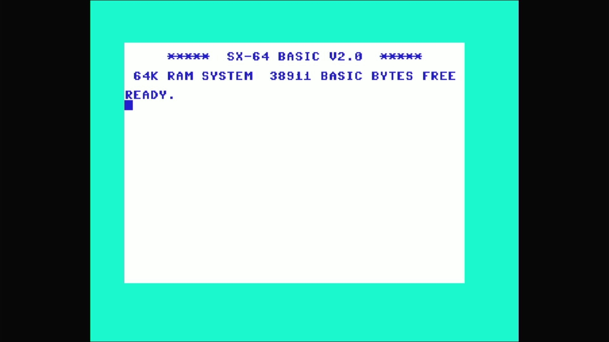

# VIP-64 (Sweden/Finland SX-64, PAL)



- **`make MACHINE=vip64`** — Commodore Business Machines
- **Year**: 1984
- **Manufacturer**: Commodore Business Machines
- **Television**: PAL

## At power-on

The VIP-64 is the Swedish/Finnish-market portable SX-64. It carries the
SX-64's KERNAL — so it draws the same **distinct sign-on**: `***** SX-64
BASIC V2.0 *****`, `64K RAM SYSTEM  38911 BASIC BYTES FREE`, `READY.`, the
SX kernal's inverted colour scheme (dark-blue text on a white screen) — but
its kernal (`kernelsx.ud3`) is a *Swedish* variant, paired with a Swedish
character generator (`charswe.ud1`), the appliance's proof this is the
Swedish SX romset and not a plain SX-64.

## The built-in drive

Like every machine in the `sx64_state` family, the VIP-64's defining
hardware is its internal 1541. The `pal_sx` machine config **replaces the
iec8 slot's default** with the built-in drive (`sx1541`):

```
CBM_IEC_SLOT(config.replace(), "iec8", 8, sx1541_iec_devices, "sx1541");
```

This drive is **built-in hardware**, and built-in hardware is never removed:
the appliance ships the machine as the driver defines it, with no `-iec8`
override. MAME's `sx1541` default at device 8 stands, so the machine requires
the `sx1541` drive romset and boots to the Swedish SX kernal's own sign-on
**with its internal drive present**. (The C64-line `-iec8 ""` bake applies
only to machines whose device-8 default models an *external*, plug-in drive —
never to a built-in one.)

## Required assets

- `roms/vip64.zip`

  | ROM | CRC32 |
  |---|---|
  | `901226-01.ud4` (basic) | `f833d117` |
  | `kernelsx.ud3` (kernal SX Swedish) | `7858d3d7` |
  | `charswe.ud1` (chargen Swedish) | `bee9b3fd` |
  | `906114-01.ue4` (PLA) | `54c89351` |

  A distinct romset — not a `#define` alias of `rom_sx64`. The Swedish SX
  KERNAL (`kernelsx.ud3`) and the Swedish character generator
  (`charswe.ud1`) are unique to this machine and come from its own
  split-set zip; the chargen is byte-identical in content to `c64_se`'s
  `charswe.u5`. The basic and PLA are byte-identical to `c64`'s members,
  located by CRC32 in the parent `c64.zip` and repacked under the
  `ud4`/`ue4` board-position names vip64 expects.

- `roms/sx1541.zip` — the built-in drive's device romset (looked up by the
  device shortname `sx1541`).

  | ROM | CRC32 |
  |---|---|
  | `325302-01.uab4` (always loaded) | `29ae9752` |
  | `901229-05 ae.uab5` (r5, default BIOS) | `361c9f37` |
  | `jiffydos sx1541` (BIOS 1) | `783575f6` |
  | `1541 flash.uab5` (BIOS 2) | `22f7757e` |

  The VIP-64's internal SX1541 is built-in hardware and ships its romset. Its
  `ROM_START( sx1541 )` (in `src/devices/bus/cbmiec/c1541.cpp`) defaults to
  BIOS `r5`; the self-contained split-set zip is staged verbatim (all four
  members). Member filenames contain spaces and must be preserved exactly.

[← back to Commodore](README.md)
