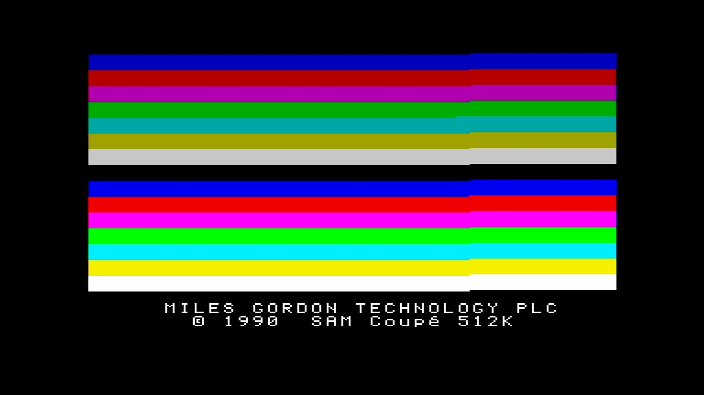

# SAM Coupé

- **`make kernel MACHINE=samcoupe`** — SAM Coupé
- **Year**: 1989
- **Manufacturer**: Miles Gordon Technology plc

## At power-on

`SAM Coupé` at power-on on the real board — see the capture above.

## Required assets

- `roms/samcoupe.zip`

  | ROM | CRC32 |
  |---|---|
  | `rom31.z5` | `0b7e3585` |
  | `rom30.z5` | `e535c25d` |
  | `rom25.z5` | `ddadd358` |
  | `rom24.z5` | `bb23fee4` |
  | `rom21.z5` | `f6804b46` |
  | `rom20.z5` | `eaf32054` |
  | `rom181.z5` | `d25e1de1` |
  | `rom18.z5` | `f626063f` |
  | `rom14.z5` | `08799596` |
  | `rom13.z5` | `2093768c` |
  | `rom12.z5` | `7fe37dd8` |
  | `rom10.z5` | `3659d31f` |
  | `rom04.z5` | `f439e84e` |
  | `rom01.z5` | `c04acfdf` |
  | `atom.z5` | `dec75f58` |

## Notes

- MAME driver: `samcoupe.cpp`.

[← back to SAM Coupé](README.md)
