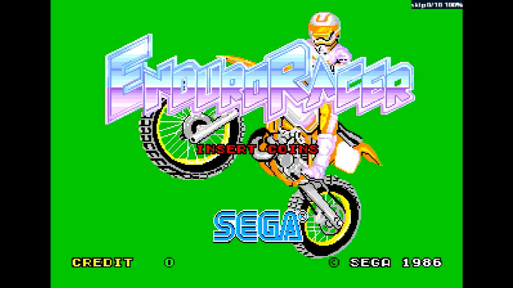

# Enduro Racer (Rev A, YM2151, FD1089B 317-0013A)

- **`make kernel MACHINE=enduror`** — Sega
- **Year**: 1986
- **Manufacturer**: Sega

## At power-on

`Enduro Racer (Rev A, YM2151, FD1089B 317-0013A)` at power-on on the real board — see the capture above.

## Required assets

- `roms/enduror.zip`

  | ROM | CRC32 |
  |---|---|
  | `epr-7640a.ic97` | `1d1dc5d4` |
  | `epr-7636a.ic84` | `84131639` |
  | `epr-7641.ic98` | `2503ae7c` |
  | `epr-7637.ic85` | `82a27a8c` |
  | `epr-7642.ic99` | `1c453bea` |
  | `epr-7638.ic86` | `70544779` |
  | `epr-7634a.ic54` | `aec83731` |
  | `epr-7635a.ic67` | `b2fce96f` |
  | `epr-7644.ic31` | `e7a4ff90` |
  | `epr-7645.ic46` | `4caa0095` |
  | `epr-7646.ic60` | `7e432683` |
  | `epr-7678.ic36` | `9fb5e656` |
  | `epr-7670.ic28` | `dbbe2f6e` |
  | `epr-7662.ic18` | `cb0c13c5` |
  | `epr-7654.ic8` | `2db6520d` |
  | `epr-7677.ic35` | `7764765b` |
  | `epr-7669.ic27` | `f9525faa` |
  | `epr-7661.ic17` | `fe93a79b` |
  | `epr-7653.ic7` | `46a52114` |
  | `epr-7676.ic34` | `2e42e0d4` |
  | `epr-7668.ic26` | `e115ce33` |
  | `epr-7660.ic16` | `86dfbb68` |
  | `epr-7652.ic6` | `2880cfdb` |
  | `epr-7675.ic33` | `05cd2d61` |
  | `epr-7667.ic25` | `923bde9d` |
  | `epr-7659.ic15` | `629dc8ce` |
  | `epr-7651.ic5` | `d7902bad` |
  | `epr-7674.ic32` | `1a129acf` |
  | `epr-7666.ic24` | `23697257` |
  | `epr-7658.ic14` | `1677f24f` |
  | `epr-7650.ic4` | `642635ec` |
  | `epr-7673.ic31` | `82602394` |
  | `epr-7665.ic23` | `12d77607` |
  | `epr-7657.ic13` | `8158839c` |
  | `epr-7649.ic3` | `4edba14c` |
  | `epr-7672.ic30` | `d11452f7` |
  | `epr-7664.ic22` | `0df2cfad` |
  | `epr-7656.ic12` | `6c741272` |
  | `epr-7648.ic2` | `983ea830` |
  | `epr-7671.ic29` | `b0c7fdc6` |
  | `epr-7663.ic21` | `2b0b8f08` |
  | `epr-7655.ic11` | `3433fe7b` |
  | `epr-7647.ic1` | `2e7fbec0` |
  | `epr-7633.ic1` | `6f146210` |
  | `epr-7682.ic58` | `c4efbf48` |
  | `epr-7681.ic8` | `bc0c4d12` |
  | `epr-7680.ic7` | `627b3c8c` |
  | `epr-6844.ic123` | `e3ec7bd6` |
  | `317-0013a.key` | `a965b2da` |

## Notes

- MAME driver: `segahang.cpp`.

[← back to Sega](README.md)
