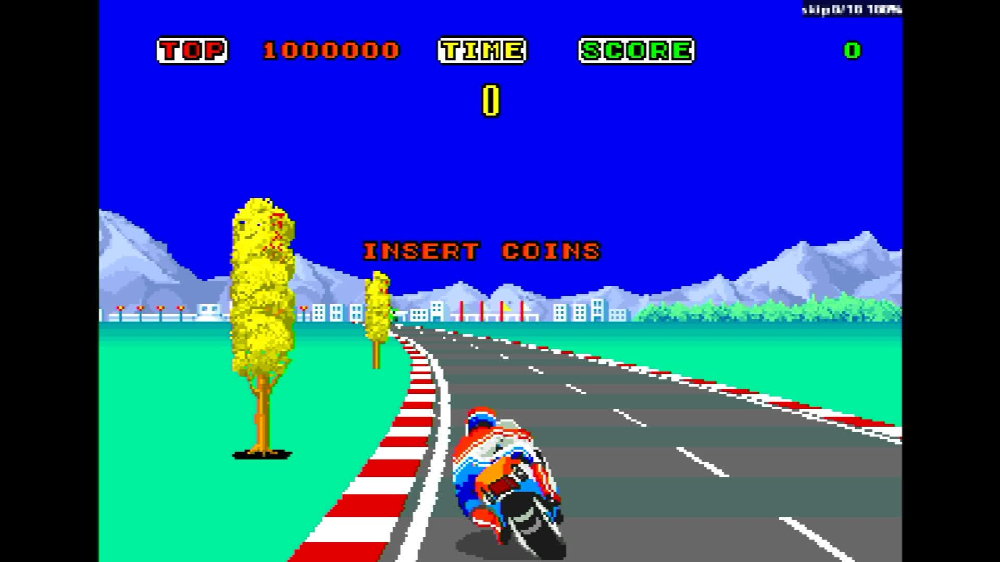

# Hang-On (Rev A)

- **`make kernel MACHINE=hangon`** — Sega
- **Year**: 1985
- **Manufacturer**: Sega

## At power-on

`Hang-On (Rev A)` at power-on on the real board — see the capture above.

## Required assets

- `roms/hangon.zip`

  | ROM | CRC32 |
  |---|---|
  | `epr-6918a.ic22` | `20b1c2b0` |
  | `epr-6916a.ic8` | `7d9db1bf` |
  | `epr-6917a.ic20` | `fea12367` |
  | `epr-6915a.ic6` | `ac883240` |
  | `epr-6920.ic63` | `1c95013e` |
  | `epr-6919.ic51` | `6ca30d69` |
  | `epr-6841.ic38` | `54d295dc` |
  | `epr-6842.ic23` | `f677b568` |
  | `epr-6843.ic7` | `a257f0da` |
  | `epr-6819.ic27` | `469dad07` |
  | `epr-6820.ic34` | `87cbc6de` |
  | `epr-6821.ic28` | `15792969` |
  | `epr-6822.ic35` | `e9718de5` |
  | `epr-6823.ic29` | `49422691` |
  | `epr-6824.ic36` | `701deaa4` |
  | `epr-6825.ic30` | `6e23c8b4` |
  | `epr-6826.ic37` | `77d0de2c` |
  | `epr-6827.ic31` | `7fa1bfb6` |
  | `epr-6828.ic38` | `8e880c93` |
  | `epr-6829.ic32` | `7ca0952d` |
  | `epr-6830.ic39` | `b1a63aef` |
  | `epr-6845.ic18` | `ba08c9b8` |
  | `epr-6846.ic25` | `f21e57a3` |
  | `epr-6840.ic108` | `581230e3` |
  | `epr-6833.ic73` | `3b942f5f` |
  | `epr-6831.ic5` | `cfef5481` |
  | `epr-6832.ic6` | `4165aea5` |
  | `epr-6844.ic123` | `e3ec7bd6` |
  | `315-5118.bin` | `51d448a2` |
  | `315-5119.bin` | `a37f00e1` |
  | `315-5120.bin` | `ba5f92ec` |
  | `315-5103.6e` | `85284c32` |
  | `315-5121.2a` | `5dd89643` |

## Notes

- MAME driver: `segahang.cpp`.

[← back to Sega](README.md)
