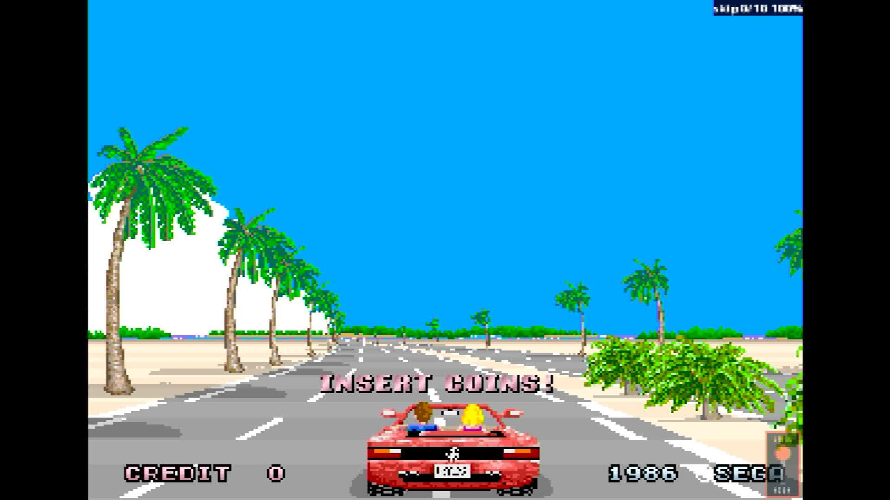

# Out Run (sitdown/upright, Rev B)

- **`make kernel MACHINE=outrun`** — Sega
- **Year**: 1986
- **Manufacturer**: Sega

## At power-on

`Out Run (sitdown/upright, Rev B)` at power-on on the real board — see the capture above.

## Required assets

- `roms/outrun.zip`

  | ROM | CRC32 |
  |---|---|
  | `epr-10380b.133` | `1f6cadad` |
  | `epr-10382b.118` | `c4c3fa1a` |
  | `epr-10381b.132` | `be8c412b` |
  | `epr-10383b.117` | `10a2014a` |
  | `epr-10327a.76` | `e28a5baf` |
  | `epr-10329a.58` | `da131c81` |
  | `epr-10328a.75` | `d5ec5e5d` |
  | `epr-10330a.57` | `ba9ec82a` |
  | `opr-10268.99` | `95344b04` |
  | `opr-10232.102` | `776ba1eb` |
  | `opr-10267.100` | `a85bb823` |
  | `opr-10231.103` | `8908bcbf` |
  | `opr-10266.101` | `9f6f1a74` |
  | `opr-10230.104` | `686f5e50` |
  | `mpr-10371.9` | `7cc86208` |
  | `mpr-10373.10` | `b0d26ac9` |
  | `mpr-10375.11` | `59b60bd7` |
  | `mpr-10377.12` | `17a1b04a` |
  | `mpr-10372.13` | `b557078c` |
  | `mpr-10374.14` | `8051e517` |
  | `mpr-10376.15` | `f3b8f318` |
  | `mpr-10378.16` | `a1062984` |
  | `opr-10186.47` | `22794426` |
  | `opr-10185.11` | `22794426` |
  | `epr-10187.88` | `a10abaa9` |
  | `opr-10193.66` | `bcd10dde` |
  | `opr-10192.67` | `770f1270` |
  | `opr-10191.68` | `20a284ab` |
  | `opr-10190.69` | `7cab70e2` |
  | `opr-10189.70` | `01366b54` |
  | `opr-10188.71` | `bad30ad9` |

## Notes

- MAME driver: `segaorun.cpp`.

[← back to Sega](README.md)
