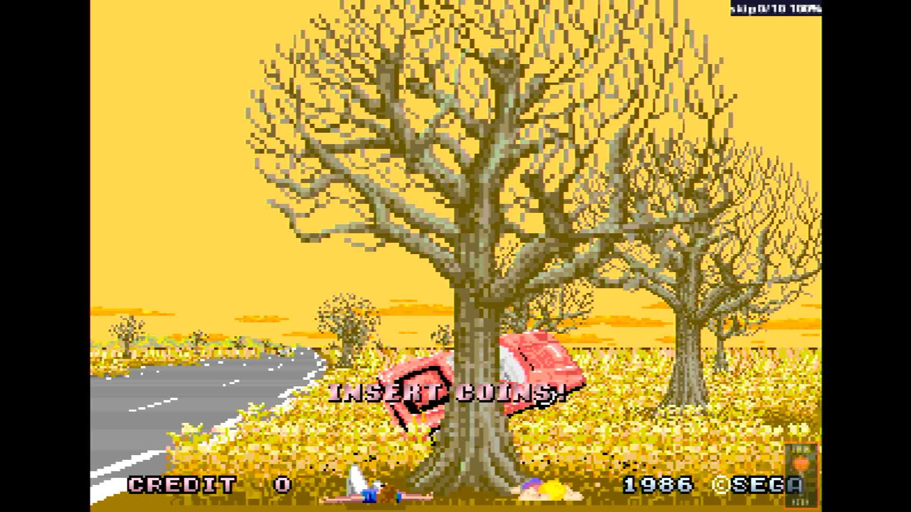

# Out Run (deluxe sitdown)

- **`make kernel MACHINE=outrundx`** — Sega
- **Year**: 1986
- **Manufacturer**: Sega

## At power-on

`Out Run (deluxe sitdown)` at power-on on the real board — see the capture above.

## Required assets

- `roms/outrundx.zip`

  | ROM | CRC32 |
  |---|---|
  | `epr-10380.133` | `e339e87a` |
  | `epr-10382.118` | `65248dd5` |
  | `epr-10381.132` | `be8c412b` |
  | `epr-10383.117` | `dcc586e7` |
  | `epr-10327.76` | `da99d855` |
  | `epr-10329.58` | `fe0fa5e2` |
  | `epr-10328.75` | `3c0e9a7f` |
  | `epr-10330.57` | `59786e99` |
  | `opr-10268.99` | `95344b04` |
  | `opr-10232.102` | `776ba1eb` |
  | `opr-10267.100` | `a85bb823` |
  | `opr-10231.103` | `8908bcbf` |
  | `opr-10266.101` | `9f6f1a74` |
  | `opr-10230.104` | `686f5e50` |
  | `epr-10194.26` | `f0eda3bd` |
  | `epr-10203.38` | `8445a622` |
  | `epr-10212.52` | `dee7e731` |
  | `epr-10221.66` | `43431387` |
  | `epr-10195.27` | `0de75cdd` |
  | `epr-10204.39` | `5f4b5abb` |
  | `epr-10213.53` | `1d1b22f0` |
  | `epr-10222.67` | `a254c706` |
  | `epr-10196.28` | `8688bb59` |
  | `epr-10205.40` | `74bd93ca` |
  | `epr-10214.54` | `57527e18` |
  | `epr-10223.68` | `3850690e` |
  | `epr-10197.29` | `009165a6` |
  | `epr-10206.41` | `954542c5` |
  | `epr-10215.55` | `69be5a6c` |
  | `epr-10224.69` | `5cffc346` |
  | `epr-10198.30` | `d894992e` |
  | `epr-10207.42` | `ca61cea4` |
  | `epr-10216.56` | `d394134d` |
  | `epr-10225.70` | `0a5d1f2b` |
  | `epr-10199.31` | `86376af6` |
  | `epr-10208.43` | `6830b7fa` |
  | `epr-10217.57` | `bf2c9b76` |
  | `epr-10226.71` | `5a452474` |
  | `epr-10200.32` | `1e5d4f73` |
  | `epr-10209.44` | `5c15419e` |
  | `epr-10218.58` | `db4bdb39` |
  | `epr-10227.72` | `c7def392` |
  | `epr-10201.33` | `1d9d4b9c` |
  | `epr-10210.45` | `39422931` |
  | `epr-10219.59` | `e73b9224` |
  | `epr-10228.73` | `25803978` |
  | `opr-10186.47` | `22794426` |
  | `opr-10185.11` | `22794426` |
  | `epr-10187.88` | `a10abaa9` |
  | `opr-10193.66` | `bcd10dde` |
  | `opr-10192.67` | `770f1270` |
  | `opr-10191.68` | `20a284ab` |
  | `opr-10190.69` | `7cab70e2` |
  | `opr-10189.70` | `01366b54` |
  | `opr-10188.71` | `bad30ad9` |

## Notes

- MAME driver: `segaorun.cpp`.
- MAME clone of `outrun` (Out Run (sitdown/upright, Rev B)) — the system macro's parent field in the driver source. The ROM table above lists every member this machine's own zip needs.

[← back to Sega](README.md)
