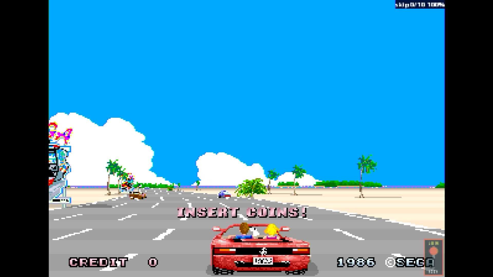

# Out Run (sitdown/upright, Rev A)

- **`make kernel MACHINE=outrunra`** — Sega
- **Year**: 1986
- **Manufacturer**: Sega

## At power-on

`Out Run (sitdown/upright, Rev A)` at power-on on the real board — see the capture above.

## Required assets

- `roms/outrunra.zip`

  | ROM | CRC32 |
  |---|---|
  | `epr-10380a.133` | `434fadbc` |
  | `epr-10382a.118` | `1ddcc04e` |
  | `epr-10381a.132` | `be8c412b` |
  | `epr-10383a.117` | `dcc586e7` |
  | `epr-10327a.76` | `e28a5baf` |
  | `epr-10329a.58` | `da131c81` |
  | `epr-10328a.75` | `d5ec5e5d` |
  | `epr-10330a.57` | `ba9ec82a` |
  | `opr-10268.99` | `95344b04` |
  | `opr-10232.102` | `776ba1eb` |
  | `opr-10267.100` | `a85bb823` |
  | `opr-10231.103` | `8908bcbf` |
  | `opr-10266.101` | `9f6f1a74` |
  | `opr-10230.104` | `686f5e50` |
  | `mpr-10371.9` | `7cc86208` |
  | `mpr-10373.10` | `b0d26ac9` |
  | `mpr-10375.11` | `59b60bd7` |
  | `mpr-10377.12` | `17a1b04a` |
  | `mpr-10372.13` | `b557078c` |
  | `mpr-10374.14` | `8051e517` |
  | `mpr-10376.15` | `f3b8f318` |
  | `mpr-10378.16` | `a1062984` |
  | `opr-10186.47` | `22794426` |
  | `opr-10185.11` | `22794426` |
  | `epr-10187.88` | `a10abaa9` |
  | `opr-10193.66` | `bcd10dde` |
  | `opr-10192.67` | `770f1270` |
  | `opr-10191.68` | `20a284ab` |
  | `opr-10190.69` | `7cab70e2` |
  | `opr-10189.70` | `01366b54` |
  | `opr-10188.71` | `bad30ad9` |

## Notes

- MAME driver: `segaorun.cpp`.
- MAME clone of `outrun` (Out Run (sitdown/upright, Rev B)) — the system macro's parent field in the driver source. The ROM table above lists every member this machine's own zip needs.

[← back to Sega](README.md)
