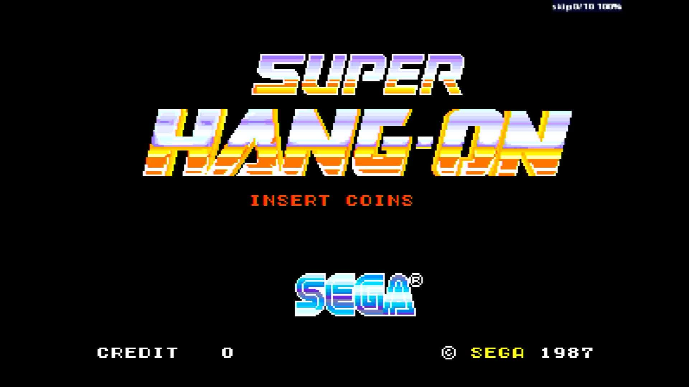

# Super Hang-On (sitdown/upright) (unprotected)

- **`make kernel MACHINE=shangon`** — Sega
- **Year**: 1987
- **Manufacturer**: Sega

## At power-on

`Super Hang-On (sitdown/upright) (unprotected)` at power-on on the real board — see the capture above.

## Required assets

- `roms/shangon.zip`

  | ROM | CRC32 |
  |---|---|
  | `epr-10886.133` | `8be3cd36` |
  | `epr-10884.118` | `cb06150d` |
  | `epr-10887.132` | `8d248bb0` |
  | `epr-10885.117` | `70795f26` |
  | `epr-10792.76` | `16299d25` |
  | `epr-10790.58` | `2246cbc1` |
  | `epr-10793.75` | `d9525427` |
  | `epr-10791.57` | `5faf4cbe` |
  | `epr-10652.54` | `260286f9` |
  | `epr-10651.55` | `c609ee7b` |
  | `epr-10650.56` | `b236a403` |
  | `mpr-10794.8` | `7c958e63` |
  | `mpr-10798.16` | `7d58f807` |
  | `mpr-10795.6` | `d9d31f8c` |
  | `mpr-10799.14` | `96d90d3d` |
  | `mpr-10796.4` | `fb48957c` |
  | `mpr-10800.12` | `feaff98e` |
  | `mpr-10797.2` | `27f2870d` |
  | `mpr-10801.10` | `12781795` |
  | `epr-10642.47` | `7836bcc3` |
  | `epr-10649c.88` | `f6c1ce71` |
  | `epr-10643.66` | `06f55364` |
  | `epr-10644.67` | `b41d541d` |
  | `epr-10645.68` | `a60dabff` |
  | `epr-10646.69` | `473cc411` |

## Notes

- MAME driver: `segaorun.cpp`.

[← back to Sega](README.md)
