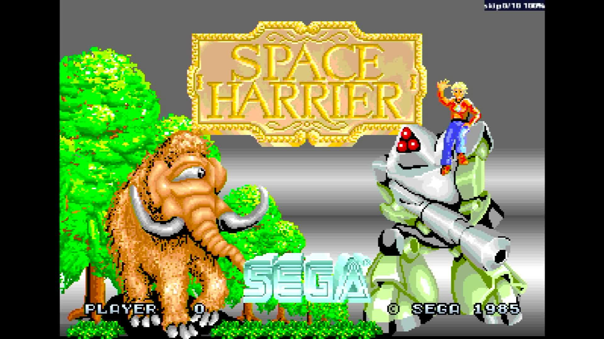

# Space Harrier (Rev A, 8751 315-5163A)

- **`make kernel MACHINE=sharrier`** — Sega
- **Year**: 1985
- **Manufacturer**: Sega

## At power-on

`Space Harrier (Rev A, 8751 315-5163A)` at power-on on the real board — see the capture above.

## Required assets

- `roms/sharrier.zip`

  | ROM | CRC32 |
  |---|---|
  | `epr-7188a.ic97` | `45e173c3` |
  | `epr-7184a.ic84` | `e1934a51` |
  | `epr-7189.ic98` | `40b1309f` |
  | `epr-7185.ic85` | `ce78045c` |
  | `epr-7190.ic99` | `f6391091` |
  | `epr-7186.ic86` | `79b367d7` |
  | `epr-7191.ic100` | `6171e9d3` |
  | `epr-7187.ic87` | `70cb72ef` |
  | `epr-7182.ic54` | `d7c535b6` |
  | `epr-7183.ic67` | `a6153af8` |
  | `epr-7196.ic31` | `347fa325` |
  | `epr-7197.ic46` | `39d98bd1` |
  | `epr-7198.ic60` | `3da3ea6b` |
  | `epr-7230.ic36` | `93e2d264` |
  | `epr-7222.ic28` | `edbf5fc3` |
  | `epr-7214.ic18` | `e8c537d8` |
  | `epr-7206.ic8` | `22844fa4` |
  | `epr-7229.ic35` | `cd6e7500` |
  | `epr-7221.ic27` | `41f25a9c` |
  | `epr-7213.ic17` | `5bb09a67` |
  | `epr-7205.ic7` | `dcaa2ebf` |
  | `epr-7228.ic34` | `d5e15e66` |
  | `epr-7220.ic26` | `ac62ae2e` |
  | `epr-7212.ic16` | `9c782295` |
  | `epr-7204.ic6` | `3711105c` |
  | `epr-7227.ic33` | `60d7c1bb` |
  | `epr-7219.ic25` | `f6330038` |
  | `epr-7211.ic15` | `60737b98` |
  | `epr-7203.ic5` | `70fb5ebb` |
  | `epr-7226.ic32` | `6d7b5c97` |
  | `epr-7218.ic24` | `cebf797c` |
  | `epr-7210.ic14` | `24596a8b` |
  | `epr-7202.ic4` | `b537d082` |
  | `epr-7225.ic31` | `5e784271` |
  | `epr-7217.ic23` | `510e5e10` |
  | `epr-7209.ic13` | `7a2dad15` |
  | `epr-7201.ic3` | `f5ba4e08` |
  | `epr-7224.ic30` | `ec42c9ef` |
  | `epr-7216.ic22` | `6d4a7d7a` |
  | `epr-7208.ic12` | `0f732717` |
  | `epr-7200.ic2` | `fc3bf8f3` |
  | `epr-7223.ic29` | `ed51fdc4` |
  | `epr-7215.ic21` | `dfe75f3d` |
  | `epr-7207.ic11` | `a2c07741` |
  | `epr-7199.ic1` | `b191e22f` |
  | `epr-7181.ic2` | `b4740419` |
  | `epr-7234.ic73` | `d6397933` |
  | `epr-7233.ic72` | `504e76d9` |
  | `epr-7231.ic5` | `871c6b14` |
  | `epr-7232.ic6` | `4b59340c` |
  | `315-5163a.ic32` | `203dffeb` |
  | `epr-6844.ic123` | `e3ec7bd6` |

## Notes

- MAME driver: `segahang.cpp`.

[← back to Sega](README.md)
