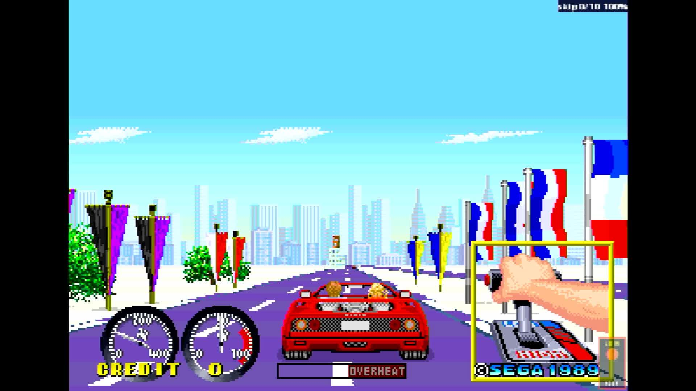

# Turbo Out Run (Out Run upgrade) (FD1094 317-0118)

- **`make kernel MACHINE=toutrun`** — Sega
- **Year**: 1989
- **Manufacturer**: Sega

## At power-on

`Turbo Out Run (Out Run upgrade) (FD1094 317-0118)` at power-on on the real board — see the capture above.

## Required assets

- `roms/toutrun.zip`

  | ROM | CRC32 |
  |---|---|
  | `epr-12513.133` | `ae8835a5` |
  | `epr-12512.118` | `f90372ad` |
  | `epr-12515.132` | `1f047df4` |
  | `epr-12514.117` | `5539e9c3` |
  | `epr-12293.131` | `f4321eea` |
  | `epr-12292.116` | `51d98af0` |
  | `317-0118.key` | `083d7d56` |
  | `opr-12295.76` | `d43a3a84` |
  | `opr-12294.58` | `27cdcfd3` |
  | `opr-12297.75` | `1d9b5677` |
  | `opr-12296.57` | `0a513671` |
  | `opr-12323.102` | `4de43a6f` |
  | `opr-12324.103` | `24607a55` |
  | `opr-12325.104` | `1405137a` |
  | `mpr-12336.9` | `dda465c7` |
  | `mpr-12337.10` | `828233d1` |
  | `mpr-12338.11` | `46b4b5f4` |
  | `mpr-12339.12` | `0d7e3bab` |
  | `mpr-12364.13` | `a4b83e65` |
  | `mpr-12365.14` | `4a80b2a9` |
  | `mpr-12366.15` | `385cb3ab` |
  | `mpr-12367.16` | `4930254a` |
  | `epr-12299.47` | `fc9bc41b` |
  | `epr-12298.11` | `fc9bc41b` |
  | `epr-12300.88` | `e8ff7011` |
  | `opr-12301.66` | `6e78ad15` |
  | `opr-12302.67` | `e72928af` |
  | `opr-12303.68` | `8384205c` |
  | `opr-12304.69` | `e1762ac3` |
  | `opr-12305.70` | `ba9ce677` |
  | `opr-12306.71` | `e49249fd` |

## Notes

- MAME driver: `segaorun.cpp`.

[← back to Sega](README.md)
