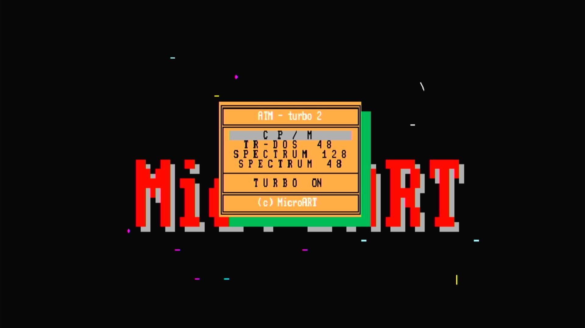

# ATM-Turbo 2

- **`make kernel MACHINE=atmtb2`** — Sinclair
- **Year**: 1992
- **Manufacturer**: MicroART
- **Television**: PAL

## At power-on

A Russian turbo Spectrum clone, boots to a MicroART firmware menu (CP/M, TR-DOS 48, Spectrum 128, Spectrum 48, Turbo On) over a red MicroART logo on the PAL canvas.

## Required assets

- `roms/atmtb2.zip`

  | ROM | CRC32 |
  |---|---|
  | `atm106.rom` | `75350b37` |
  | `atm106-1.rom` | `658c98f1` |
  | `atm106-2.rom` | `8fe367f9` |
  | `atm106-3.rom` | `124ad9e0` |
  | `atm106-4.rom` | `f352f2ab` |
  | `rf2ve3.rom` | `35e0f9ec` |
  | `rfat710.rom` | `03734365` |
  | `sgen.rom` | `1f4387d6` |
- `roms/betadisk.zip`

## Notes

- MAME driver: `atm.cpp`.
- MAME clone of `spec128` (ZX Spectrum 128) — the system macro's parent field in the driver source. The ROM table above lists every member this machine's own zip needs.

[← back to Sinclair](README.md)
