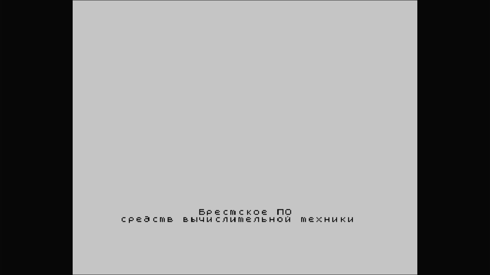

# PEVM Byte

- **`make kernel MACHINE=byte`** — Sinclair
- **Year**: 1990
- **Manufacturer**: BEMZ
- **Television**: PAL

## At power-on

A Soviet Spectrum clone from the Brest Electromechanical Plant, its Prusak firmware boots to a Cyrillic maker's credit (`Брестское ПО` / `средств вычислительной техники`) at the foot of the grey PAL canvas.

## Required assets

- `roms/byte.zip`

  | ROM | CRC32 |
  |---|---|
  | `byte.rom` | `c13ba473` |
  | `dd72.bin` | `2464d537` |
  | `dd73.bin` | `bd430288` |
  | `dd71_rt7.bin` | `c91b07c2` |
  | `dd66_rt5.bin` | `f8f9766a` |
  | `dd10_rt5.reva.bin` | `aae13e3e` |
  | `dd10_rt5.revb.bin` | `b649b5d1` |
  | `dd11_rt5.bin` | `0f32b304` |

## Notes

- MAME driver: `byte.cpp`.
- MAME clone of `spectrum` (ZX Spectrum) — the system macro's parent field in the driver source. The ROM table above lists every member this machine's own zip needs.
- Self-contained: Prusak boot ROMs + the DD66/DD71 and TBD PROMs.

[← back to Sinclair](README.md)
