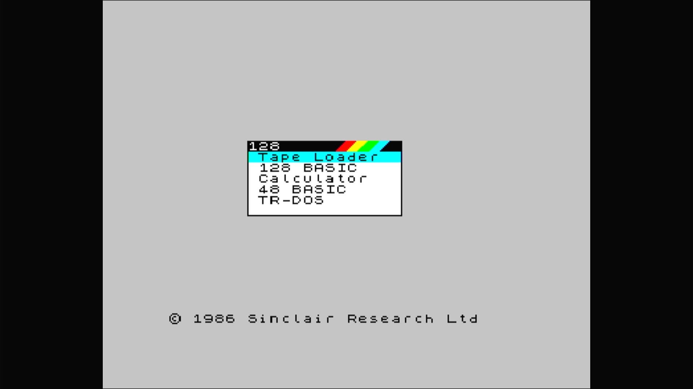

# Pentagon 128K

- **`make kernel MACHINE=pentagon`** — Sinclair
- **Year**: 1991
- **Manufacturer**: Vladimir Drozdov
- **Television**: PAL

## At power-on

A Russian Spectrum clone, boots to a 128-style startup menu (Tape Loader, 128 BASIC, Calculator, 48 BASIC, TR-DOS) on the PAL canvas.

## Required assets

- `roms/pentagon.zip`

  | ROM | CRC32 |
  |---|---|
  | `128p-0.rom` | `124ad9e0` |
  | `128p-1.rom` | `b96a36be` |
  | `128tr93.rom` | `08ad241c` |
  | `pentagon.rom` | `aa1ce4bd` |
  | `pent-es.rom` | `34d04bae` |
  | `sos89r.rom` | `09c9e7e1` |
  | `basic90.rom` | `a41575ba` |
  | `sos48.rom` | `ceb4005d` |
  | `m48a.rom` | `a3b4def6` |
  | `zxvgs-22-0.rom` | `63041c61` |
  | `zxvgs-22-1.rom` | `f3736047` |
  | `zxvg-29-0.rom` | `3b66f433` |
  | `zxvg-1.rom` | `a8baca3e` |
  | `zxvg-30-0.rom` | `533e0f26` |
  | `zxvg-31-0.rom` | `76f43500` |
  | `zxvg-35-0.rom` | `5cc8b3b1` |
  | `neos_512.rom` | `1657fa43` |
- `roms/betadisk.zip`

## Notes

- MAME driver: `pentagon.cpp`.
- MAME clone of `spec128` (ZX Spectrum 128) — the system macro's parent field in the driver source. The ROM table above lists every member this machine's own zip needs.
- Its built-in Beta Disk interface carries a TR-DOS entry on the startup menu.

[← back to Sinclair](README.md)
