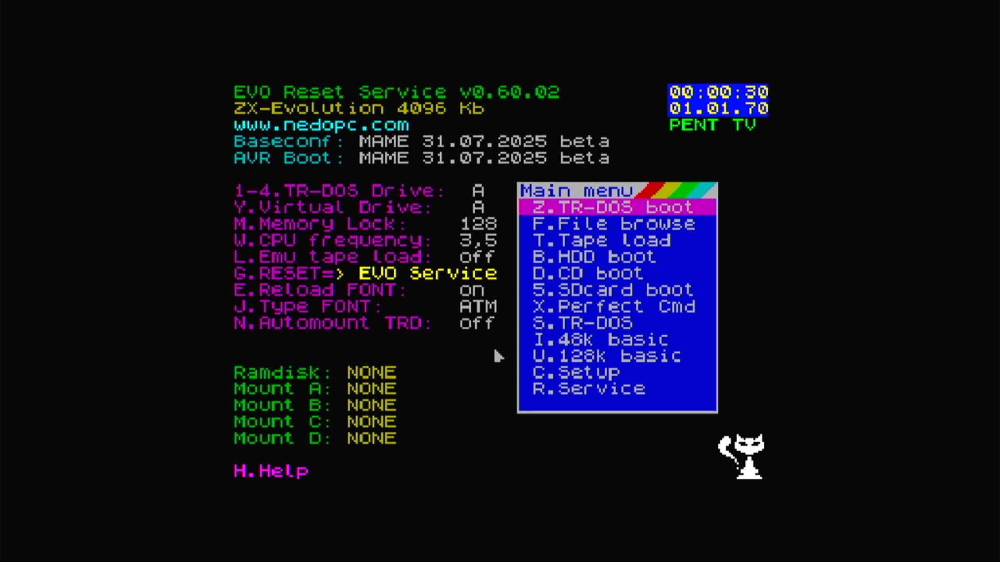

# ZX Evolution: BASECONF

- **`make kernel MACHINE=pentevo`** — Sinclair
- **Year**: 2009
- **Manufacturer**: NedoPC
- **Television**: PAL

## At power-on

An open-hardware Spectrum clone, boots the EVO Reset Service v0.60.02 firmware to a BASECONF menu (TR-DOS boot, File browse, Tape load, SD-card boot, 48K/128K BASIC, …) beside a settings panel, on the PAL canvas.

## Required assets

- `roms/pentevo.zip`

  | ROM | CRC32 |
  |---|---|
  | `zxevo_05902fe.rom` | `df144c82` |
  | `zxevo_05904.rom` | `8cae52eb` |
  | `zxevo_05912.rom` | `e0e95f9f` |
  | `zxevo_05912fe.rom` | `4c9300b1` |
  | `zxevo_05913.rom` | `b75bf957` |
  | `zxevo_05913fe.rom` | `a4de8eb8` |
  | `zxevo_06002.rom` | `0c828b6c` |
  | `zxevo_06002fe.rom` | `b7ac7a2d` |
  | `zxevo_fw.bin` | `aefbd8e5` |
- `roms/betadisk.zip`

## Notes

- MAME driver: `pentevo.cpp`.
- MAME clone of `spec128` (ZX Spectrum 128) — the system macro's parent field in the driver source. The ROM table above lists every member this machine's own zip needs.

[← back to Sinclair](README.md)
