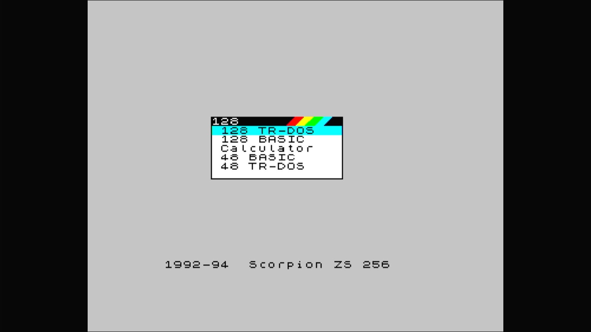

# Scorpion ZS-256 (Yellow PCB)

- **`make kernel MACHINE=scorpio`** — Sinclair
- **Year**: 1992
- **Manufacturer**: Scorpion, Ltd.
- **Television**: PAL

## At power-on

The Russian "Yellow PCB" clone, V.2.94 firmware boots to a menu (128 TR-DOS, 128 BASIC, Calculator, 48 BASIC, 48 TR-DOS) on the PAL canvas.

## Required assets

- `roms/scorpio.zip`

  | ROM | CRC32 |
  |---|---|
  | `scorp0.rom` | `0eb40a09` |
  | `scorp1.rom` | `9d513013` |
  | `scorp2.rom` | `fd0d3ce1` |
  | `scorp3.rom` | `1fe1d003` |
  | `scorpion.rom` | `fef73c28` |
  | `scorp294.rom` | `99f57ce1` |
  | `neos_256.rom` | `364ae09a` |
  | `scorp_test.rom` | `e0230ca7` |
  | `scrpkey.rom` | `e938a510` |
  | `gs104.rom` | `7a365ba6` |
  | `gs105a.rom` | `1cd490c6` |
- `roms/betadisk.zip`

## Notes

- MAME driver: `scorpion.cpp`.
- MAME clone of `spec128` (ZX Spectrum 128) — the system macro's parent field in the driver source. The ROM table above lists every member this machine's own zip needs.

[← back to Sinclair](README.md)
