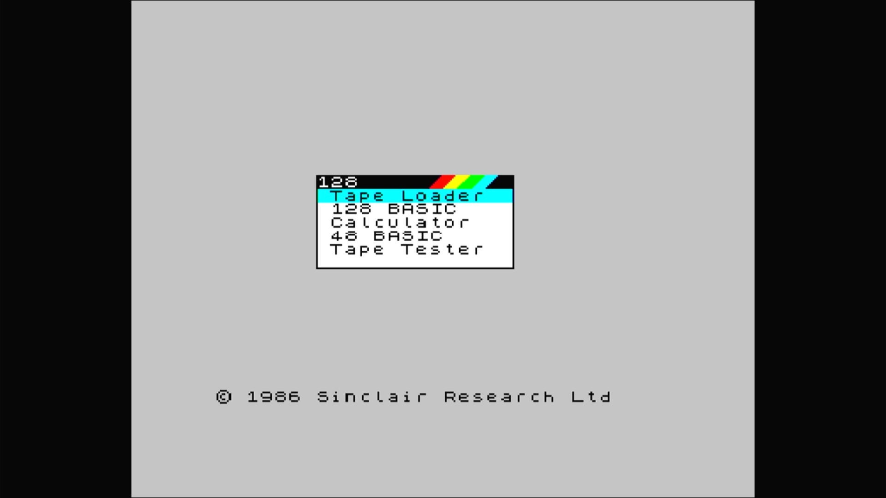

# ZX Spectrum 128

- **`make MACHINE=spec128`** — Sinclair
- **Year**: 1986
- **Manufacturer**: Sinclair Research Ltd
- **Television**: PAL

## At power-on

ZX Spectrum 128 startup menu (128 BASIC, Tape Loader, …).

## Required assets

- `roms/spec128.zip`

  | ROM | CRC32 |
  |---|---|
  | `zx128_0.rom` | `e76799d2` |
  | `zx128_1.rom` | `b96a36be` |

## Notes

- Its romset is also the shared parent for `pentagon`, `scorpio`, `atmtb2`, and `pentevo` — those four need `spec128.zip` on the card alongside their own zip.

[← back to Sinclair](README.md)
