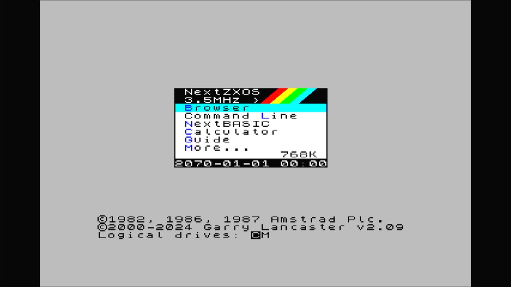

# ZX Spectrum Next, KS1 board (2020 Kickstarter)

- **`make kernel MACHINE=specnext_ks1`** — Sinclair
- **Year**: 2020
- **Manufacturer**: SpecNext Ltd., Victor Trucco, Fabio Belavenuto
- **Television**: PAL

## At power-on

ZX Spectrum Next / NextZXOS on the KS1 board, booting from its attached SD card image.

## Required assets

- `roms/tbblue.zip` (shared with `tbblue`)

  | ROM | CRC32 |
  |---|---|
  | `boot-30204.bin` | `95118eb6` |
- `next/next.img` — the Next's SD card image, attached as its hard disk

## Notes

- A ROM-compatible clone of `tbblue`: its ROM_START is a literal alias of `tbblue`'s, so it reads `tbblue.zip` — no separate romset.

[← back to Sinclair](README.md)
