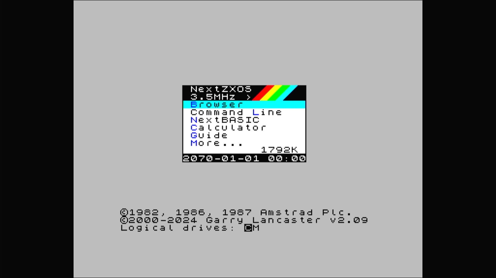

# ZX Spectrum Next, KS3 board (2025 Kickstarter)

- **`make kernel MACHINE=specnext_ks3`** — Sinclair
- **Year**: 2025
- **Manufacturer**: SpecNext Ltd., Victor Trucco, Fabio Belavenuto
- **Television**: PAL

## At power-on

ZX Spectrum Next / NextZXOS on the KS3 board, booting from its attached SD card image.

## Required assets

- `roms/tbblue.zip` (shared with `tbblue`)

  | ROM | CRC32 |
  |---|---|
  | `boot-30204.bin` | `95118eb6` |
- `next/next.img` — the Next's SD card image, attached as its hard disk

## Notes

- Its own ROM_START, but a trimmed BIOS list naming only files `tbblue.zip` already carries (`boot-30204.bin`, `boot-30204-ab.bin`) — no separate romset.

[← back to Sinclair](README.md)
