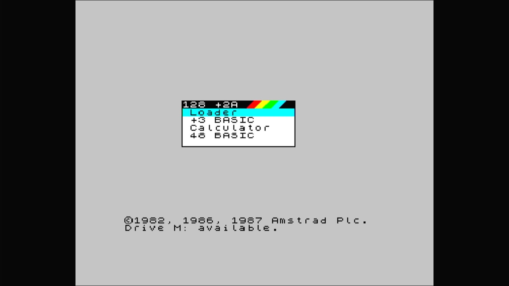

# ZX Spectrum +2a

- **`make kernel MACHINE=specpl2a`** — Sinclair
- **Year**: 1987
- **Manufacturer**: Amstrad plc
- **Television**: PAL

## At power-on

ZX Spectrum +2a startup menu (Loader, +3 BASIC, Calculator, 48 BASIC) — the +3's firmware in the +2's cassette case.

## Required assets

- `roms/specpl2a.zip`

  | ROM | CRC32 |
  |---|---|
  | `40092.ic7` | `9bc85686` |
  | `40093.ic8` | `db551783` |

[← back to Sinclair](README.md)
