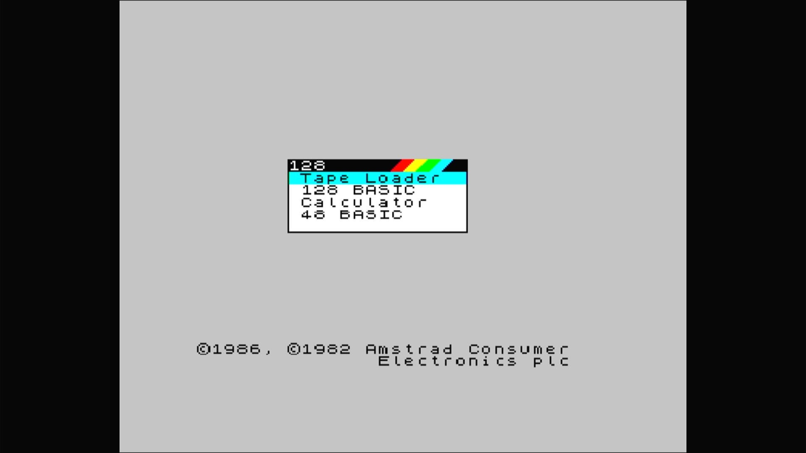

# ZX Spectrum +2

- **`make kernel MACHINE=specpls2`** — Sinclair
- **Year**: 1986
- **Manufacturer**: Amstrad plc
- **Television**: PAL

## At power-on

ZX Spectrum +2 startup menu — Amstrad's grey 128.

## Required assets

- `roms/specpls2.zip`

  | ROM | CRC32 |
  |---|---|
  | `zxp2_0.rom` | `5d2e8c66` |
  | `zxp2_1.rom` | `98b1320b` |
  | `plus2fr0.rom` | `c684c535` |
  | `plus2fr1.rom` | `f5e509c5` |
  | `plus2sp0.rom` | `e807d06e` |
  | `plus2sp1.rom` | `41981d4b` |
  | `plus2c-0.rom` | `bfddf748` |
  | `plus2c-1.rom` | `fd8552b6` |
  | `pl2namco.rom` | `72a54e75` |

## Notes

- MAME driver: `spec128.cpp`.
- MAME clone of `spec128` (ZX Spectrum 128) — the system macro's parent field in the driver source. The ROM table above lists every member this machine's own zip needs.

[← back to Sinclair](README.md)
