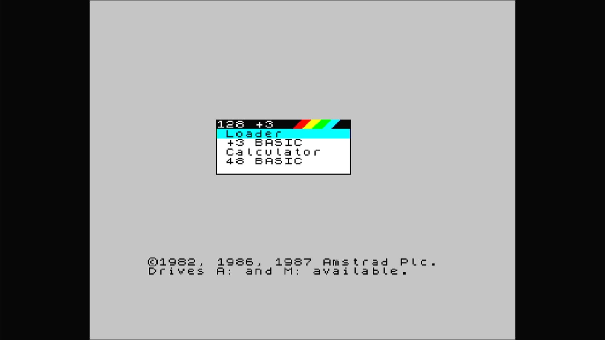
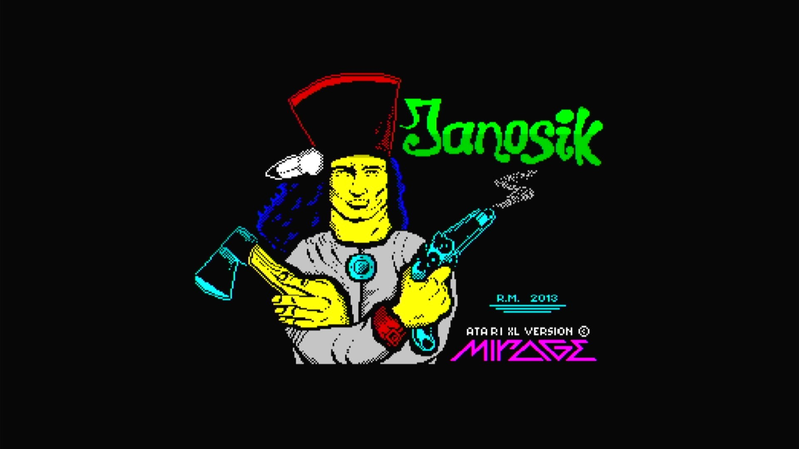

# ZX Spectrum +3

- **`make kernel MACHINE=specpls3`** — Sinclair
- **Year**: 1987
- **Manufacturer**: Amstrad plc
- **Television**: PAL

## At power-on

ZX Spectrum +3 startup menu (Loader, +3 BASIC, Calculator, 48 BASIC; drives A: and M:) — the same firmware with the built-in 3" floppy drive.

## Required assets

- `roms/specpls3.zip`

  | ROM | CRC32 |
  |---|---|
  | `40092.ic7` | `9bc85686` |
  | `40093.ic8` | `db551783` |

## Booting media

Janosik (Rafal Miazga / Alex Heather, 2013, freeware) loaded from a `.dsk`
floppy via the +3 Loader, showing its title screen — its credit line
still reads the game's original Atari XL release (R.M., 2013, Mirage).

[← back to Sinclair](README.md)
