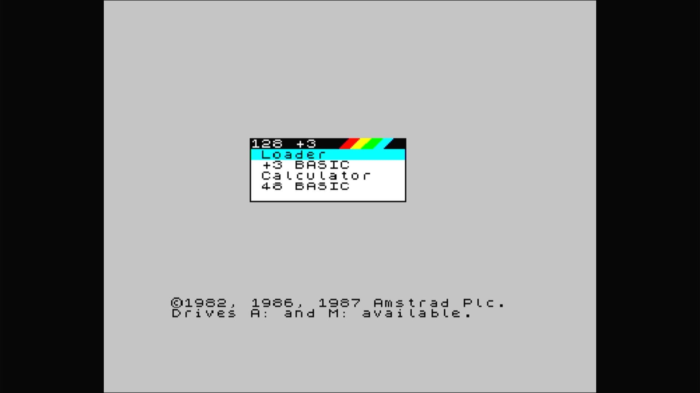
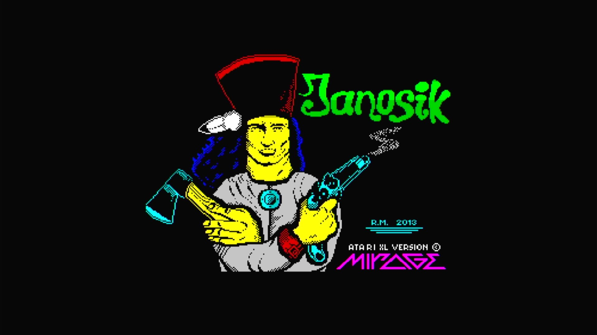

# ZX Spectrum +3

- **`make kernel MACHINE=specpls3`** — Sinclair
- **Year**: 1987
- **Manufacturer**: Amstrad plc
- **Television**: PAL

## At power-on

ZX Spectrum +3 startup menu (Loader, +3 BASIC, Calculator, 48 BASIC; drives A: and M:) — the same firmware with the built-in 3" floppy drive.

## Required assets

- `roms/specpls3.zip`

  | ROM | CRC32 |
  |---|---|
  | `40092.ic7` | `9bc85686` |
  | `40093.ic8` | `db551783` |
  | `40094.ic7` | `392242fb` |
  | `40101.ic8` | `5daaae01` |
  | `40092u.ic7` | `80808d82` |
  | `40093u.ic8` | `61f2b50c` |
  | `40094s.ic7` | `9d102acf` |
  | `40101s.ic8` | `1408ddce` |
  | `p3_01_4m.rom` | `ad99380a` |
  | `p3_23_4m.rom` | `07727895` |
  | `p3_01_cm.rom` | `ad99380a` |
  | `p3_23_cm.rom` | `61f2b50c` |

## Notes

- MAME driver: `specpls3.cpp`.
- MAME clone of `specpl2a` (ZX Spectrum +2a) — the system macro's parent field in the driver source. The ROM table above lists every member this machine's own zip needs.

## Booting media

Janosik (Rafal Miazga / Alex Heather, 2013, freeware) loaded from a `.dsk` floppy via the +3 Loader, showing its title screen — its credit line still reads the game's original Atari XL release (R.M., 2013, Mirage).

[← back to Sinclair](README.md)
