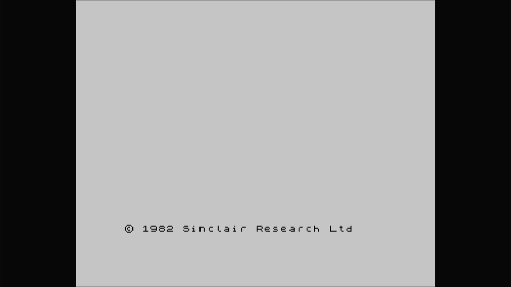

# 48K ZX Spectrum

- **`make kernel MACHINE=spectrum`** — Sinclair
- **Year**: 1982
- **Manufacturer**: Sinclair Research Ltd
- **Television**: PAL

## At power-on

48K ZX Spectrum BASIC.

## Required assets

- `roms/spectrum.zip`

  | ROM | CRC32 |
  |---|---|
  | `spectrum.rom` | `ddee531f` |

[← back to Sinclair](README.md)
