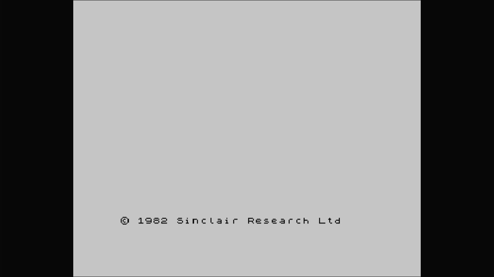

# ZX Spectrum

- **`make kernel MACHINE=spectrum`** — Sinclair
- **Year**: 1982
- **Manufacturer**: Sinclair Research Ltd
- **Television**: PAL

## At power-on

48K ZX Spectrum BASIC.

## Required assets

- `roms/spectrum.zip`

  | ROM | CRC32 |
  |---|---|
  | `spectrum.rom` | `ddee531f` |
  | `48e.rom` | `f051746e` |
  | `0,1.eprom1` | `6b807b7a` |
  | `2,3.eprom2` | `f54a389b` |
  | `bsrom118.rom` | `1511cddb` |
  | `bsrom140.rom` | `07017c6d` |
  | `groot.rom` | `abf18c45` |
  | `48turbo.rom` | `56189781` |
  | `psycho.rom` | `cd60b589` |
  | `turbo2_3.rom` | `fd3b0413` |
  | `turbo4_4.rom` | `338b6e87` |
  | `imc.rom` | `d1be99ee` |
  | `plus4.rom` | `7e0f47cb` |
  | `deutsch.rom` | `1a9190f4` |
  | `hdt-iso.rom` | `b81c570c` |
  | `sc01.rom` | `73b4057a` |
  | `gw03.rom` | `5585d7c2` |
  | `1986es.rom` | `9e0fdaaa` |
  | `jgh.rom` | `7224138e` |
  | `isomoje.rom` | `62ab3640` |
  | `iso8bm.rom` | `43e9c2fd` |
  | `diagrom.v28` | `aadf967e` |
  | `diagrom.v31` | `cddbb11e` |
  | `diagrom.v33` | `0fb080e1` |
  | `diagrom.v34` | `50478f29` |
  | `diagrom.v35` | `c869b642` |
  | `diagrom.v47` | `be329fc0` |
  | `diagrom.v50` | `054a2d6a` |
  | `diagrom.v51` | `83034df6` |
  | `diagrom.v56` | `0ed22f7a` |
  | `diagrom.v59` | `90e2ca5a` |
  | `testromv037.bin` | `a7ea3d1c` |

## Notes

- MAME driver: `spectrum.cpp`.

[← back to Sinclair](README.md)
