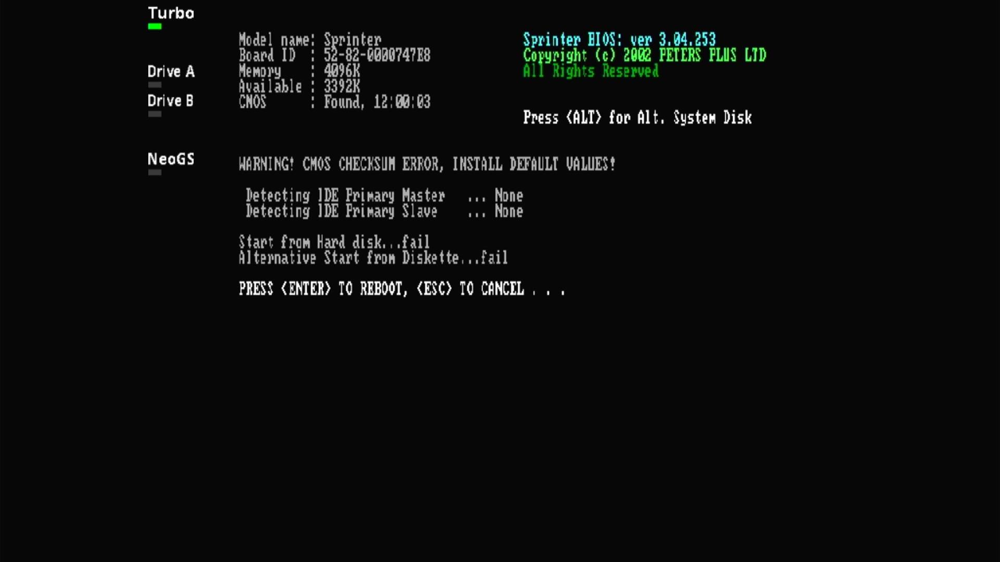

# Peters Plus Sprinter

- **`make MACHINE=sprinter`** — Sinclair
- **Year**: 2000
- **Manufacturer**: Peters Plus, Ivan Mak
- **Television**: PAL

## At power-on

A Z84C015-plus-FPGA Spectrum-compatible, its Sprinter BIOS v3.04.253 powers on to a BIOS report (model name, board ID, 4096K memory, CMOS clock) and, with no CF/IDE media shipped, `Detecting IDE Primary Master ... None` and `Start from Hard disk...fail` / `Alternative Start from Diskette...fail`, on the PAL canvas.

## Required assets

- `roms/sprinter.zip`

  | ROM | CRC32 |
  |---|---|
  | `sp2k-3.04.rom` | `1729cb5c` |
- `roms/kb_ms_natural.zip` — the `natural.bin` ROM for its PS/2 keyboard device

[← back to Sinclair](README.md)
