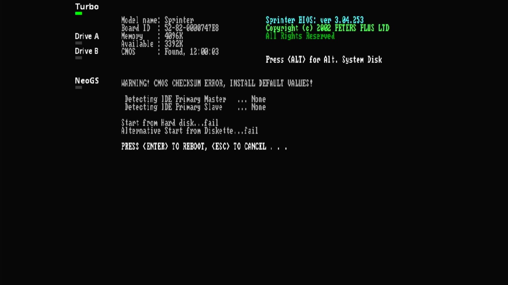

# Sprinter Sp2000

- **`make kernel MACHINE=sprinter`** — Sinclair
- **Year**: 2000
- **Manufacturer**: Peters Plus, Ivan Mak
- **Television**: PAL

## At power-on

A Z84C015-plus-FPGA Spectrum-compatible, its Sprinter BIOS v3.04.253 powers on to a BIOS report (model name, board ID, 4096K memory, CMOS clock) and, with no CF/IDE media shipped, `Detecting IDE Primary Master ... None` and `Start from Hard disk...fail` / `Alternative Start from Diskette...fail`, on the PAL canvas.

## Required assets

- `roms/sprinter.zip`

  | ROM | CRC32 |
  |---|---|
  | `sp2k-2.13.rom` | `6495575f` |
  | `sp2k-2.17.rom` | `3c7f1025` |
  | `sp2k-3.00.rom` | `193de3da` |
  | `sp2k-3.03.rom` | `fe26f578` |
  | `sp2k-3.04.rom` | `1729cb5c` |
  | `sp2k-3.05.rom` | `fe1c2685` |
  | `sp2k-3.06.rom` | `187f4382` |
- `roms/kb_ms_natural.zip`

## Notes

- MAME driver: `sprinter.cpp`.
- MAME clone of `spec128` (ZX Spectrum 128) — the system macro's parent field in the driver source. The ROM table above lists every member this machine's own zip needs.

[← back to Sinclair](README.md)
