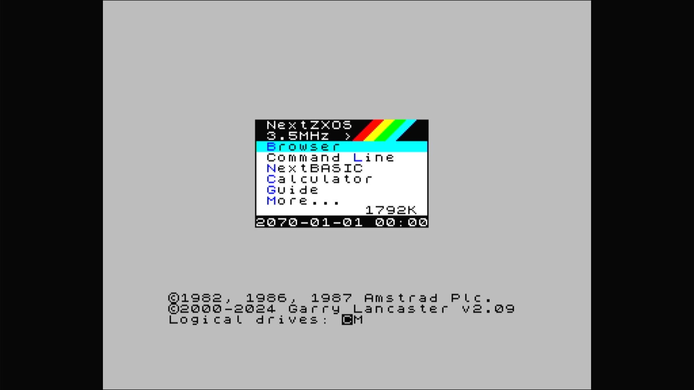

# ZX Spectrum Next: Emulators ID

- **`make kernel MACHINE=tbblue`** — Sinclair
- **Year**: 2017
- **Manufacturer**: SpecNext Ltd., Victor Trucco, Fabio Belavenuto
- **Television**: PAL

## At power-on

ZX Spectrum Next / NextZXOS, booting from its attached SD card image.

## Required assets

- `roms/tbblue.zip`

  | ROM | CRC32 |
  |---|---|
  | `boot-30100.bin` | `ccbd55ba` |
  | `boot-30200-ab.bin` | `1d16e9d4` |
  | `boot-30204.bin` | `95118eb6` |
  | `boot-30204-ab.bin` | `96c32007` |
- `media/hard/tbblue/next.img`

## Notes

- MAME driver: `specnext.cpp`.
- `specnext_ks1`, `specnext_ks2`, and `specnext_ks3` are ROM-compatible clones that also need this zip — see their own pages.

[← back to Sinclair](README.md)
