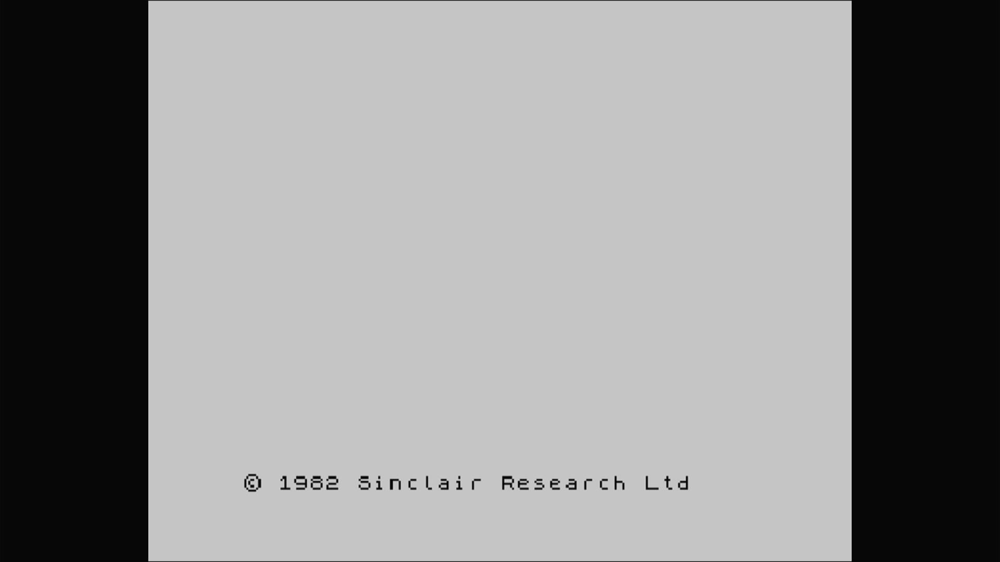

# TC-2048

- **`make kernel MACHINE=tc2048`** — Sinclair
- **Year**: 1984
- **Manufacturer**: Timex of Portugal
- **Television**: PAL

## At power-on

A 48K-compatible Spectrum, boots to `© 1982 Sinclair Research Ltd`.

## Required assets

- `roms/tc2048.zip`

  | ROM | CRC32 |
  |---|---|
  | `tc2048.rom` | `f1b5fa67` |

## Notes

- MAME driver: `timex.cpp`.
- MAME clone of `spectrum` (ZX Spectrum) — the system macro's parent field in the driver source. The ROM table above lists every member this machine's own zip needs.

[← back to Sinclair](README.md)
