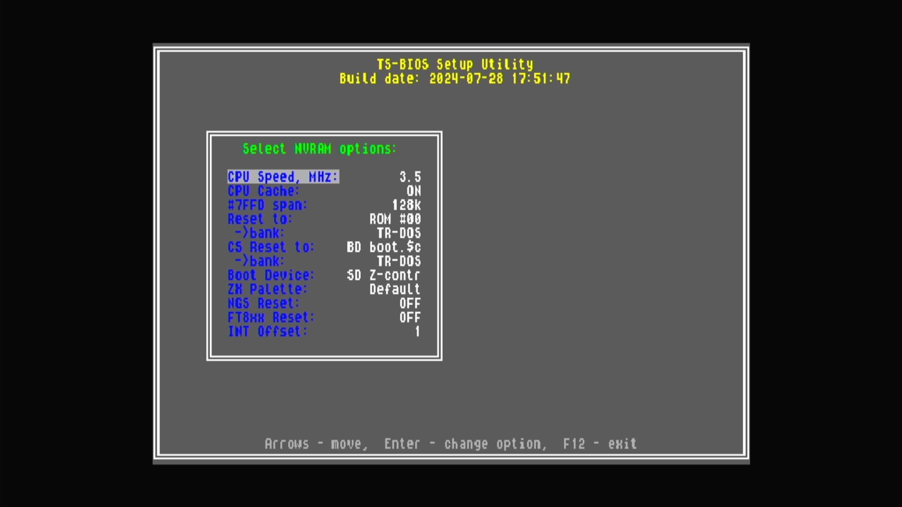

# ZX Evolution: TS-Configuration

- **`make kernel MACHINE=tsconf`** — Sinclair
- **Year**: 2011
- **Manufacturer**: NedoPC, TS-Labs
- **Television**: PAL

## At power-on

An FPGA-based Spectrum clone with the TS-Configuration video/DMA extensions, boots its TS-BIOS on the PAL canvas.

## Required assets

- `roms/tsconf.zip`

  | ROM | CRC32 |
  |---|---|
  | `ts-bios.240728.rom` | `19f8ad7b` |
  | `cram-init.bin` | `8b96ffb7` |

## Notes

- Self-contained: TS-BIOS + CRAM init, no shared parent romset.

[← back to Sinclair](README.md)
