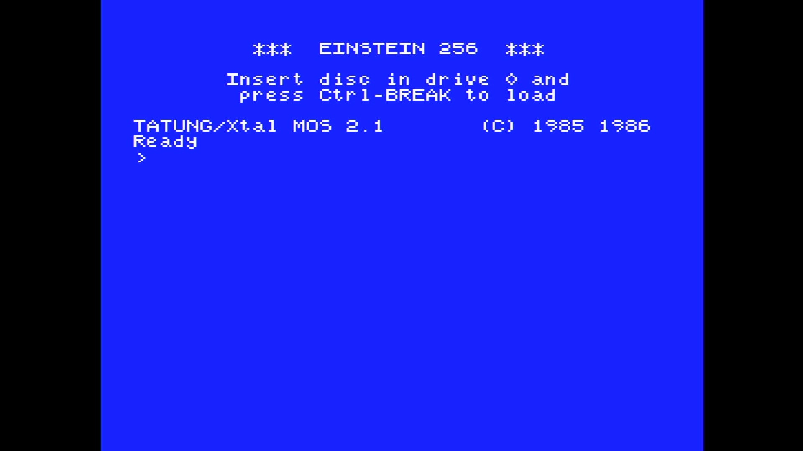

# Einstein 256

- **`make kernel MACHINE=einst256`** — Tatung
- **Year**: 1986
- **Manufacturer**: Tatung

## At power-on

`Einstein 256` at power-on on the real board — see the capture above.

## Required assets

- `roms/einst256.zip`

  | ROM | CRC32 |
  |---|---|
  | `mos21.i008` | `d1bb5efc` |

## Notes

- MAME driver: `einstein.cpp`.

[← back to Tatung](README.md)
