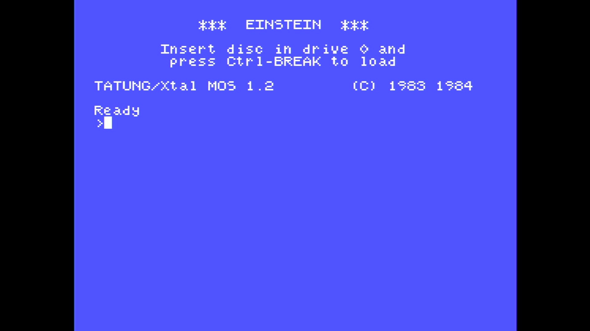

# Einstein TC-01

- **`make kernel MACHINE=einstein`** — Tatung
- **Year**: 1984
- **Manufacturer**: Tatung

## At power-on

`Einstein TC-01` at power-on on the real board — see the capture above.

## Required assets

- `roms/einstein.zip`

  | ROM | CRC32 |
  |---|---|
  | `mos12.i023` | `ec134953` |
  | `mos121.i023` | `a746eeb6` |

## Notes

- MAME driver: `einstein.cpp`.

[← back to Tatung](README.md)
