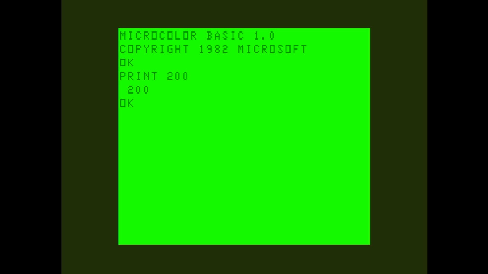

# Alice

- **`make kernel MACHINE=alice`** — TRS / Tandy
- **Year**: 1983
- **Manufacturer**: Matra & Hachette

## At power-on

`Alice` at power-on on the real board — see the capture above.

## Required assets

- `roms/alice.zip`

  | ROM | CRC32 |
  |---|---|
  | `alice.rom` | `f876abe9` |

## Notes

- MAME driver: `mc10.cpp`.
- MAME clone of `mc10` (MC-10) — the system macro's parent field in the driver source. The ROM table above lists every member this machine's own zip needs.

[← back to TRS / Tandy](README.md)
