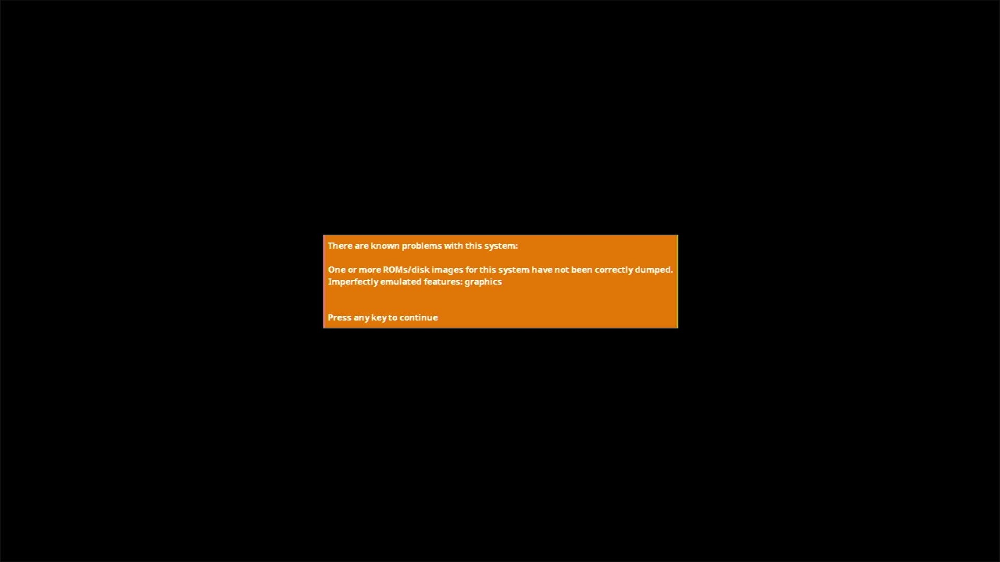

# Alice 90

- **`make kernel MACHINE=alice90`** — TRS / Tandy
- **Year**: 1985
- **Manufacturer**: Matra & Hachette

## At power-on

**PARKED** — same box class as alice32 — #define rom_alice90 rom_alice32, identical BAD_DUMP charset.rom, condemned without a separate boot. The capture above shows the observed stop; the machine is not offered until the park is lifted by a policy ruling.

## Required assets

- `roms/alice90.zip`

  | ROM | CRC32 |
  |---|---|
  | `alice32.rom` | `c3854ddf` |
  | `charset.rom` | `b2f49eb3` |

## Notes

- MAME driver: `mc10.cpp`.
- MAME clone of `alice32` (Alice 32) — the system macro's parent field in the driver source. The ROM table above lists every member this machine's own zip needs.

[← back to TRS / Tandy](README.md)
