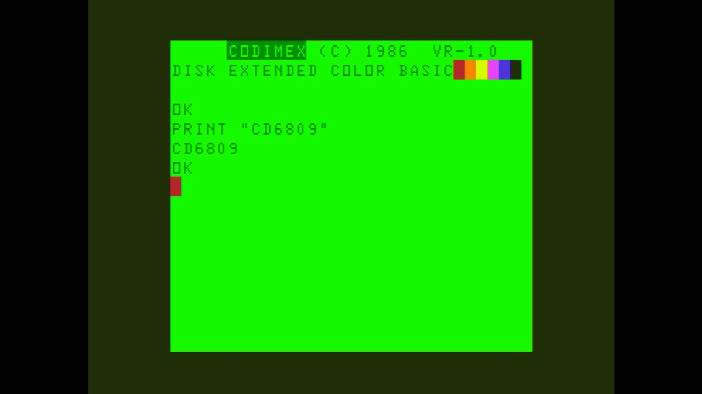

# CD-6809

- **`make kernel MACHINE=cd6809`** — TRS / Tandy
- **Year**: 1983
- **Manufacturer**: Codimex

## At power-on

`CD-6809` at power-on on the real board — see the capture above.

## Required assets

- `roms/cd6809.zip`

  | ROM | CRC32 |
  |---|---|
  | `cd6809bas83.rom` | `f8e64142` |
  | `cd6809extbas83.rom` | `e5d5aa15` |
  | `cd6809bas84.rom` | `8a9971da` |
  | `cd6809extbas84.rom` | `8dc853e2` |
- `roms/cd6809_fdc.zip`

## Notes

- MAME driver: `coco12.cpp`.
- MAME clone of `coco` (Color Computer 1/2) — the system macro's parent field in the driver source. The ROM table above lists every member this machine's own zip needs.

[← back to TRS / Tandy](README.md)
