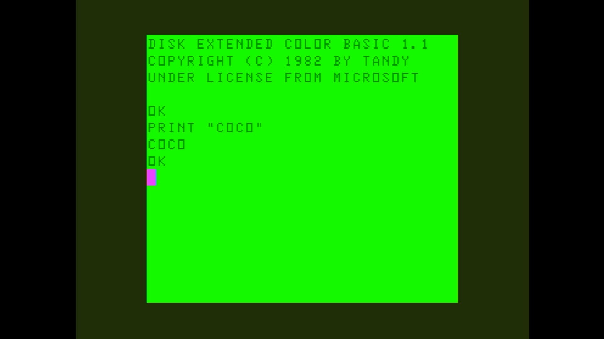

# Color Computer 1/2

- **`make kernel MACHINE=coco`** — TRS / Tandy
- **Year**: 1980
- **Manufacturer**: Tandy Radio Shack

## At power-on

`Color Computer 1/2` at power-on on the real board — see the capture above.

## Required assets

- `roms/coco.zip`

  | ROM | CRC32 |
  |---|---|
  | `bas10.rom` | `00b50aaa` |
  | `bas11.rom` | `6270955a` |
  | `bas12.rom` | `54368805` |
  | `extbas10.rom` | `6111a086` |
  | `extbas11.rom` | `a82a6254` |
- `roms/coco_fdc.zip`

## Notes

- MAME driver: `coco12.cpp`.

[← back to TRS / Tandy](README.md)
