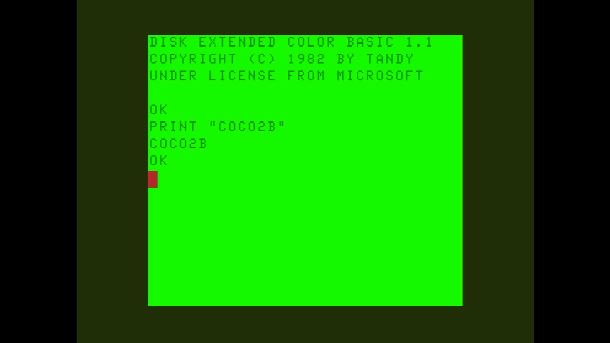

# Color Computer 2B

- **`make kernel MACHINE=coco2b`** — TRS / Tandy
- **Year**: 1985?
- **Manufacturer**: Tandy Radio Shack

## At power-on

`Color Computer 2B` at power-on on the real board — see the capture above.

## Required assets

- `roms/coco2b.zip`

  | ROM | CRC32 |
  |---|---|
  | `bas13.rom` | `d8f4d15e` |
  | `extbas11.rom` | `a82a6254` |
- `roms/coco.zip` — the shared Color Computer 1/2
- `roms/coco_fdc.zip`

## Notes

- MAME driver: `coco12.cpp`.
- MAME clone of `coco` (Color Computer 1/2) — the system macro's parent field in the driver source. The ROM table above lists every member this machine's own zip needs.

[← back to TRS / Tandy](README.md)
