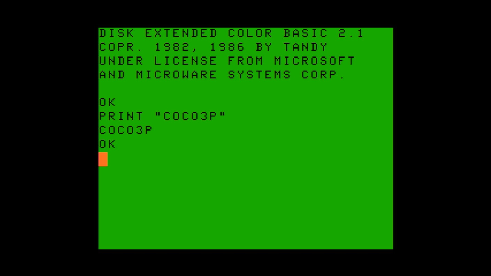

# Color Computer 3 (PAL)

- **`make kernel MACHINE=coco3p`** — TRS / Tandy
- **Year**: 1986
- **Manufacturer**: Tandy Radio Shack

## At power-on

`Color Computer 3 (PAL)` at power-on on the real board — see the capture above.

## Required assets

- `roms/coco3p.zip`

  | ROM | CRC32 |
  |---|---|
  | `coco3p.rom` | `ff050d80` |
- `roms/coco_fdc.zip`

## Notes

- MAME driver: `coco3.cpp`.
- MAME clone of `coco` (Color Computer 1/2) — the system macro's parent field in the driver source. The ROM table above lists every member this machine's own zip needs.

[← back to TRS / Tandy](README.md)
